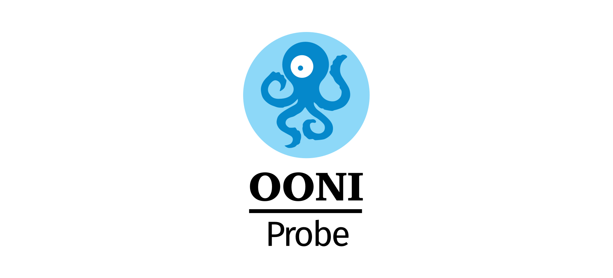

<!--
Adapted from https://github.com/othneildrew/Best-README-Template, which is
under the MIT license. So, this file is also under the MIT license.
-->

[](https://ooni.org)

<div align="center">

[](https://pkg.go.dev/github.com/ooni/probe-cli/v3) [](https://coveralls.io/github/ooni/probe-cli?branch=master) [](https://slack.openobservatory.org/)

## OONI Probe Measurement Engine and CLI

**[Install instructions »](https://ooni.org/install/cli)**

[User guide](https://ooni.org/support/ooni-probe-cli) · [API docs](https://godoc.org/github.com/ooni/probe-cli) · [Report bug](https://github.com/ooni/probe/issues/new?labels=ooni/probe-cli&assignee=bassosimone) · [Request feature](https://github.com/ooni/probe/issues/new?labels=ooni/probe-cli&assignee=bassosimone) · [Tutorials](https://github.com/ooni/probe-cli/tree/master/internal/tutorial)

</div>

<details>
  <summary>Table of Contents</summary>
  <ol>
    <li><a href="#about-this-project">About this project</a></li>
    <li><a href="#install-instructions">Install instructions</a></li>
    <li><a href="#nightly-builds">Nightly Builds</a></li>
    <li><a href="#build-instructions">Build instructions<a></li>
    <li><a href="#contributing">Contributing</a></li>
    <li><a href="#license">License</a></li>
    <li><a href="#updating-dependencies">Updating dependencies</a></li>
    <li><a href="#releasing">Releasing<a></li>
    <li><a href="#semantic-versioning-policy">Semantic versioning policy<a></li>
  </ol>
</details>

<hr>

## About this project

The [Open Observatory of Network Interference](https://ooni.org) (OONI)
is a non-profit free software project that aims to empower decentralized
efforts in documenting Internet censorship around the world.

This repository contains the following Go packages:

1. the ooniprobe command line client ([cmd/ooniprobe](cmd/ooniprobe));

2. the test helper server ([internal/cmd/oohelperd](internal/cmd/oohelperd));

3. the mobile library ([pkg/oonimkall](pkg/oonimkall));

4. the measurement-engine library ([internal](internal));

5. the miniooni experimental command line client ([internal/cmd/miniooni](internal/cmd/miniooni)).

Every top-level directory in this repository contains an explanatory README file.

## Install instructions

Follow the instructions at [ooni.org/install/cli](https://ooni.org/install/cli)
to install `ooniprobe` precompiled binaries for Windows, macOS, and
Debian/Ubuntu. Once `ooniprobe` is installed, refer to the
[user guide](https://ooni.org/support/ooni-probe-cli).

## Nightly builds

We publish nightly builds using the [rolling release tag](
https://github.com/ooni/probe-cli/releases/tag/rolling). These
builds use the latest commit of the `master` branch.

## Developer instructions

To setup development for this repository you need Go >= 1.15. The
`./script/go.bash` script will automatically download the expected
version of Go mentioned in the [GOVERSION](GOVERSION) file (i.e.,
go1.22.3) and use it for building.

You can also bypass `./script/go.bash` and build ooniprobe manually using
`go build ...` but, in such a case, note that:

1. using an older version that the one mentioned in [GOVERSION](GOVERSION)
is _definitely not recommended_ and _may not even compile_;

2. using later versions _should_ work as intended for core functionality
but extra functionality may be disabled or not working as intended.

Here's why: we rely on packages forked from the standard library; so, it is
more robust to use the same version of Go from which we forked those packages from.

You will also need a C compiler. On Linux and other Unix systems
both GCC and Clang will work. If you're using Windows, we
recommend installing Ubuntu or Debian on [the Windows Subsystem
for Linux](https://learn.microsoft.com/en-us/windows/wsl/install).
If you're targeting Windows, you should also install the
mingw-w64 cross-compiler.

### Debian developer setup

The following commands show how to setup a development
environment using Debian 12 ("bookworm"). The same instructions
should also work for Ubuntu 22.04 LTS.

```bash
# install the compilers, git, and the root CA
sudo apt install golang build-essential ca-certificates git

# [optional] install mingw-w64 if you're targeting windows
sudo apt install mingw-w64
```

### Fedora developer setup

The following commands show how to setup a development
environment using Fedora, as long as your Fedora uses Go >= 1.15.

```bash
# install the compilers and git
sudo dnf install golang make gcc gcc-c++ git

# [optional] install mingw-w64 if you're targeting windows
sudo dnf install mingw64-gcc mingw64-gcc-c++
```

### macOS developer setup

The following commands show how to setup a development
environment using macOS. We assume you have already installed
[Homebrew](https://brew.sh), which should also install the
Xcode command line tools.

Then, you need to follow these instructions:

```bash
# install the compiler
brew install go
```

### The `./script/go.bash` script

The `./script/go.bash` script requires Go >= 1.15 and automates installing and
using the correct version of Go. Running this script as follows:

```bash
./script/go.bash build -v -ldflags '-s -w' ./internal/cmd/miniooni
```

Is equivalent to running these commands:

```bash
go install -v golang.org/dl/go1.23.7@latest
$HOME/go/bin/go1.23.7 download
export GOTOOLCHAIN=local
$HOME/sdk/go1.23.7/bin/go build -v -ldflags '-s -w' ./internal/cmd/miniooni
```

### Common build targets

This section shows how to build using `./script/go.bash`. If you want to bypass
using this script, just run `go` instead of `./script/go.bash`.

You can compile `ooniprobe` using:

```bash
./script/go.bash build -v -ldflags '-s -w' ./cmd/ooniprobe
```

This command will generate a stripped binary called `ooniprobe`
in the toplevel directory.

Likewise, you can compile `miniooni` using:

```bash
./script/go.bash build -v -ldflags '-s -w' ./internal/cmd/miniooni
```

This command will generate a stripped binary called `miniooni`
in the toplevel directory.

And `oohelperd` using:

```bash
./script/go.bash build -v -ldflags '-s -w' ./internal/cmd/oohelperd
```

This command will generate a stripped binary called `oohelperd`
in the toplevel directory.

## Contributing

Please, see [CONTRIBUTING.md](CONTRIBUTING.md).

## License

```
SPDX-License-Identifier: GPL-3.0-or-later
```

## Releasing

We build releases using [Makefile](Makefile), which requires GNU make. Run
`make help` for detailed usage.

See also the relevant section of [CONTRIBUTING.md](CONTRIBUTING.md).

## Semantic versioning policy

The mobile library is a public package for technical reasons. Go mobile tools require
a public package to build from. Yet, we don't consider API breakages happening in
such a package to be sufficient to bump our major version number. For us, the mobile
library is just a mean to implement OONI Probe Android and OONI Probe iOS. We'll
only bump the major version number if we change `./cmd/ooniprobe`'s CLI.
