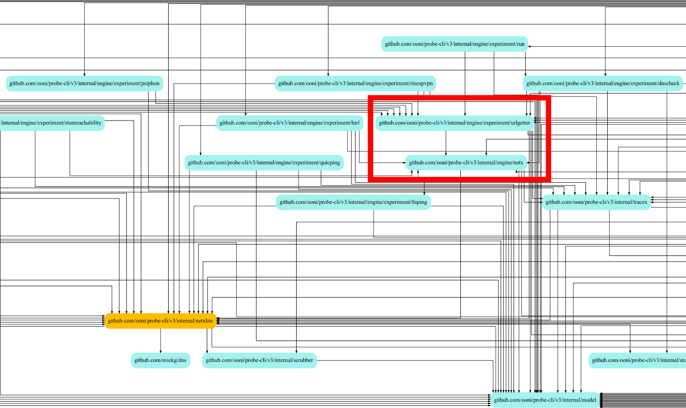
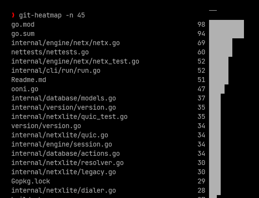

# Step-by-step measurements

|              |                                                |
|--------------|------------------------------------------------|
| Author       | [@bassosimone](https://github.com/bassosimone) |
| Last-Updated | 2022-06-29                                     |
| Reviewed-by  | [@hellais](https://github.com/hellais)         |
| Reviewed-by  | [@DecFox](https://github.com/DecFox/)          |
| Reviewed-by  | [@ainghazal](https://github.com/ainghazal/)    |
| Status       | approved                                       |
| Obsoletes    | [dd-002-netx.md](dd-002-netx.md)               |

## Abstract

The original [netx design document](dd-002-netx.md) is now two
years old. Since we wrote that document, we amended the overall design
several times. The four major design changes were:

1. saving rather than emitting
[ooni/probe-engine#359](https://github.com/ooni/probe-engine/issues/359);

2. switching to save measurements using the decorator
pattern [ooni/probe-engine#522](https://github.com/ooni/probe-engine/pull/522);

3. the netx "pivot" [ooni/probe-cli#396](https://github.com/ooni/probe-cli/pull/396);

4. measurex [ooni/probe-cli#528](https://github.com/ooni/probe-cli/pull/528).

In this (long) design document, we will revisit the original problem proposed by
[dd-002-netx.md](dd-002-netx.md), in light of all the changes and lessons
learned since then. We will highlight the significant pain points of the
current implementation, which are the following:

1. The measurement library API is significantly different from the Go stdlib
API. This violates one of the central design goals for `netx`: that writing a new
experiment would involve using constructors very similar to the standard
library. Such deviations were supposed to be made only to meet our specific
measurement goals;

2. The decorator pattern has led to complexity in creating measurement types,
which in turn seems to be the reason why the previous issue exists;

3. The decorator pattern does not allow us to precisely collect all the
data that matters for certain events (such as TCP connect and DNS round trips using
a custom transport). This suggests that we should revisit our choice of using
decorators, and revert back to some form of _constructor based injection_ to
inject a data type suitable for saving events.

Finally, this document also proposes an incremental plan for moving the tree
forward from [the current state](https://github.com/ooni/probe-cli/tree/1685ef75b5a6a0025a1fd671625b27ee989ef111)
to a state in which the complexity has been transferred from the
measurement-support library to the implementation of each individual network
experiment.

## Index

There are four main sections in this document:

[1. Netxlite: the underlying library](#1-netxlite-the-underlying-network-library)
describes the current design of the underlying network library.

[2. Measurement tactics](#2-measurement-tactics) gives an historical perspective
on different measurement tactics we adopted or tried in the past, and reflects
on their merits and downsides.

[3. Step-by-step refactoring proposal](#3-step-by-step-refactoring-proposal)
contains the main contribution of this design document: a concrete proposal to
refactor the existing codebase to address our current measurement-code
problems.

[4. Document reviews](#4-document-reviews) contains information about reviews of this document.

## 1. netxlite: the underlying network library

This section describes `netxlite`, the underlying network library, from an
historical perspective. We explain our data collection needs, and what types
from the standard library we're using as patterns.

### 1.1. Measurement Observations

Most OONI experiments need to observe and give meaning to these events:

1. DNSLookup

2. TCPConnect

3. TLSHandshake

4. QUICHandshake

5. HTTP GET

6. TCP/UDP Read

7. TCP/UDP Write

8. UDP ReadFrom

9. UDP WriteTo

Observing Read, Write, ReadFrom, and WriteTo is optional. However, these
observations provide [valuable information beyond just discussing the
blocking of resources](https://ooni.org/post/2022-russia-blocks-amid-ru-ua-conflict/#twitter-throttled).

As part of its life cycle, an OONI experiment performs these operations
multiple times. We call *observation* the result of each of these
network operations.

For each observation, we want to collect when the related operation
started and terminated.

We also want to collect input parameters and output results.

When using a custom DNS transport (e.g., DNS over HTTPS), we
should also collect the exchanged DNS messages (query and response). In
this scenario, we may also want to record the child events caused by a
DNS round trip (e.g., TCPConnect, TLSHandshake).

When we're using getaddrinfo, we should [call it directly and collect
its return code](https://github.com/ooni/probe/issues/2029).

When we measure HTTP, there are redirections. Each redirection may reuse
an existing TCP or QUIC connection, and each redirection has
an HTTP request and response. (Redirections are more complex than it
seems because of cookies; not entering into details for now but still
worth mentioning.)

The [OONI data format](https://github.com/ooni/spec/tree/master/data-formats)
defines how we archive experiment results as a set of observations.
(Orthogonally, we may also want to improve the data format, but this is
not under discussion now.)

### 1.2. Error Wrapping

The OONI data format also specifies [how we should represent
errors](https://github.com/ooni/spec/blob/master/data-formats/df-007-errors.md).
Go generates its own errors, and we should *reduce* those errors to the
set of strings specified in the OONI data format. (Orthogonally, we may
also want to introduce better errors when possible.)

We should also attribute the error to the operation that failed. In
principle, this seems easy. Yet, depending on how we're performing
measurements, it is not. More details later when appropriate.

A semi-orthogonal aspect is that we would also like to include in
collected measurements the underlying raw syscall or library errors. That would
be, e.g., getaddrinfo's return code or the Rcode of
DNS response messages or the syscall error returned by a Read call. By
adding this, we would give those who analyze the data information to
evaluate the correctness of a measurement.

### 1.3 Go Stdlib

The Go standard library provides the following structs and interfaces
that we can use for measuring:

```Go
// package net

type Resolver struct {}

func (r *Resolver) LookupHost(ctx context.Context, domain string) ([]string, error)
```

The Resolver is \~equivalent to calling getaddrinfo. However, we cannot
observe the error returned by getaddrinfo, and we do not have the
guarantee that we're actually calling getaddrinfo. (On Unix, in
particular, [we use the "netgo" resolver](https://github.com/ooni/probe/issues/2118), which
reads `/etc/resolv.conf`, when `CGO_ENABLED=0`.)

```Go
// package net

type Dialer struct {}

func (d *Dialer) DialContext(ctx context.Context, network, address string) (net.Conn, error)
```

The Dialer combines DNSLookup and TCPConnect when the address contains a
TCP/UDP endpoint in which the hostname is not an IP address (e.g.,
`dns.google:443`). To observe a TCPConnect, we need to make sure that we're
passing an address argument containing an IP address (e.g., `8.8.8.8:443`)
otherwise, the whole operation will be a DNS lookup plus one or more
TCP-connect attempts.

```Go
// package crypto/tls

type Conn struct {}

func Client(conn net.Conn, config *tls.Config) *Conn

func (c *Conn) HandshakeContext(ctx context.Context) error

func (c *Conn) ConnectionState() tls.ConnectionState
```

The above APIs in `crypto/tls` allow us to perform a TLS handshake and
observe its results. The `crypto/tls` library is quite limited, and this
[caused TLS fingerprinting issues in the
past](https://ooni.org/post/making-ooni-probe-android-more-resilient/).
To overcome this issue we devised two solutions:
[ooni/go](https://github.com/ooni/go) (which forks golang/go) and
[ooni/oocrypto](https://github.com/ooni/oocrypto) (which
is leaner, but still has
[some issues](https://github.com/ooni/probe/issues/2122)).

```Go
// package net/http

type Transport struct {
	DialContext func(ctx context.Context, network, address string) (net.Conn, error)

	DialTLSContext func (ctx context.Context, network, address string) (net.Conn, error)

	// ...
}

func (txp *Transport) RoundTrip(req *http.Request) (*http.Response, error)

func (txp *Transport) CloseIdleConnections()

type RoundTripper interface {
	RoundTrip(req *http.Request) (*http.Response, error)
}

type HTTPClient struct {
	Transport http.RoundTripper
}
```

These APIs in `net/http` allow us to create connections and observe HTTP
round trips. The stdlib assumes we're using crypto/tls for TLS
connections and fails to establish HTTP2 connections otherwise because
it cannot read the ALPN array. So we [forked
net/http](https://github.com/ooni/oocrypto) to use
alternative TLS libs (e.g., refraction-networking/utls).

We could say more here. But I am trying to be brief. Because of that, I
am glossing over HTTP3, which is not part of the standard library but is
implemented by
[lucas-clemente/quic-go](https://github.com/lucas-clemente/quic-go).
Apart from the stdlib and quic-go, the only other significant network code
dependency is [miekg/dns](https://github.com/miekg/dns)
for custom DNS resolvers (e.g., DNS-over-HTTPS).

### 1.4. Network Extensions

A reasonable idea is to try to use types as close as possible to the
standard library. By following this strategy, we can compose our code
with stdlib code. We've been doing this [since day
zero](df-002-netx.md).

We use the `netx` name to identify **net**work e**x**tensions in ooni/probe-cli.

What is great about using stdlib-like types is that we're using code
patterns that people already know.

This document is not concerned about the internal representation of `netx`, but
rather about how to offer an API that resembles the stdlib. See [internal/model/netx.go](https://github.com/ooni/probe-cli/blob/v3.15.1/internal/model/netx.go) for details on those types.

The analysis that follows, and the resulting proposal, tries to answer the
question of how we can _best use these netx types_ to perform measurements
(according to the relevant criteria). And this seems more of a software
engineering problem than anything else.

Yet, before jumping right into this topic, I think it is worth
mentioning that netx should do the following:

1. implement logging (we want ooniprobe -v to provide useful debug
information);

2. implement error wrapping and failed-operation mapping (as defined
above);

3. implement reasonable watchdog timeouts for every operation (OONI
runs in weird networks where censorship may cause OONI to become
stuck; see, for example, [ooni/probe#1609](https://github.com/ooni/probe/issues/1609)).

All network connections we create in OONI (for measuring or
communicating with support services) have these concerns. Measurement
code has additional responsibilities, such as collecting and
interpreting the network observations. The "separation of concerns" principle
suggests us that measurement code should be implemented by other packages that
depend on netxlite.

(The "lite" in `netxlite` reflects the fact that it does not concern
itself with measurements unlike [the original netx](df-002-netx.md), which contained
both basic networking wrappers and network measurement code.)

## 2. Measurement Tactics

Each subsection presents a different tactic for collecting measurement
observations, while reflecting on their pros and cons.

We revisit four distinct tactics:

* [(1) Context-based tracing](#21-context-based-tracing), 
* [(2) Decorator-based tracing](#22-decorator-based-tracing),
* [(3) Step-by-step measurements](#23-step-by-step-measurements), and
* [(4) Measurex: splitting DNSLookup and Endpoint Measurements](#24-measurex-splitting-dnslookup-and-endpoint-measurements).


### 2.1. Context-Based Tracing

This tactic is the first one we implemented. We call this approach
"tracing" because it produces a trace of the events, and it's
"context-based" because we use features of the context package to
*inject* a *Trace* in the place where we need to collect data.

The general idea is that we have stdlib-like data structures that a
programmer is already familiar with. So, we tell the programmer to do
what they do best (i.e., use the patterns they already know), and we
superimpose data collection using `Context.WithValue` and `context.Value`.

It is worth mentioning that historically we chose this approach because
the stdlib allows one to use the context to perform network tracing
([net/http/httptrace](https://pkg.go.dev/net/http/httptrace)), then
we progressively abandoned `httptrace` as our tracing needs
become more complex than what `httptrace` could provide us with.

#### How context-tracing feels like

I tried to adapt how this code would look if we used it now. As
[dd-002-netx.md](dd-002-netx.md) suggests, here I am trying to separate
data collection and interpretation, which looked like a great idea at
the time but has now become a bottleneck when writing experiments, because it
needs a lot of extra code:

```Go
// doWhatYouKnowBest uses stdlib-like constructs to collect data.
func doWhatYouKnowBest(ctx context.Context, URL string) (*http.Response, []byte, error) {
	clnt := netxlite.NewHTTPClientStdlib(log.Log)
	defer clnt.CloseIdleConnections()
	req, err := http.NewRequestWithContext(ctx, "GET", URL, nil)
	if err != nil {
		return nil, nil, err
	}
	resp, err := clnt.Do(req)
	if err != nil {
		return nil, nil, err
	}
	// the whole body could be too big, so we read only a fixed size
	r := io.LimitReader(maxBodySnapshotSize)
	data, err := netxlite.ReadAllContext(ctx, r)
	if err != nil {
		return resp, nil, err
	}
	return resp, data, nil
}

func ExperimentMain(ctx context.Context, URL string) {
	saver := tracex.NewSaver()
	ctx = saver.WrapContext(ctx)
	resp, body, err := doWhatYouKnowBest(ctx, URL)
	// ...
	trace := saver.Read()
	// figure out what happened by looking into the trace 🔥🔥🔥
}
```

As you can see, I have marked with fire emojis where we
need to figure out what happened by reading the trace. We are going
to discuss this issue in the next section.

#### Issue #1 with context tracing: distance between collection and interpretation

The nice part of this approach is that the network-interaction part of
the experiment is \~easy. The bad part is that we must figure out
what happened after the fact by inspecting the trace. In principle, this
*seems* easy. In practice, the code for producing an interpretation of the
results could become quite fragile for several experiments.

To illustrate what I mean, here's how we process the trace produced by
the telegram experiment in ooni/probe-cli@v3.15.1:

```Go
func (tk *TestKeys) Update(v urlgetter.MultiOutput) {
	// copy data from the trace into the final test keys first
	tk.NetworkEvents = append(tk.NetworkEvents, v.TestKeys.NetworkEvents...)
	tk.Queries = append(tk.Queries, v.TestKeys.Queries...)
	tk.Requests = append(tk.Requests, v.TestKeys.Requests...)
	tk.TCPConnect = append(tk.TCPConnect, v.TestKeys.TCPConnect...)
	tk.TLSHandshakes = append(tk.TLSHandshakes, v.TestKeys.TLSHandshakes...)

	// then process access points
	if v.Input.Config.Method != "GET" {
		if v.TestKeys.Failure == nil {
			tk.TelegramHTTPBlocking = false
			tk.TelegramTCPBlocking = false
			return // found successful access point connection
		}
		if v.TestKeys.FailedOperation == nil ||
			*v.TestKeys.FailedOperation != netxlite.ConnectOperation {
			tk.TelegramTCPBlocking = false
		}
		return
	}

	// now take care of web endpoints
	if tk.TelegramWebStatus != "ok" {
		return // we already flipped the state
	}
	if v.TestKeys.Failure != nil {
		tk.TelegramWebStatus = "blocked"
		tk.TelegramWebFailure = v.TestKeys.Failure
		return
	}
	title := `<title>Telegram Web</title>`
	if strings.Contains(v.TestKeys.HTTPResponseBody, title) == false {
		failureString := "telegram_missing_title_error"
		tk.TelegramWebFailure = &failureString
		tk.TelegramWebStatus = "blocked"
		return
	}
}
```

While the code above is compact, it makes me sad.  The underpinning reason
for my sadness seems to be that, with this tactic, we have lost any code
*locality*. The code for computing results is *conceptually* far away from
the code that collects observations. Producing results look more like
writing a compiler for a trace than enhancing the results of individual
operations with extra insights.

Just reflect on this fact: we have a single function for producing all
observations (not shown here) and a single function for interpreting
observations. It would feel more natural to have a single function for
each submeasuremement and have such a function deal with data collection
and interpretation. (So, how we implemented the insights
at [ooni/probe-engine#13](https://github.com/ooni/probe-engine/issues/13),
was probably misguiding us, and I think the conceptually wrong culprit is [this
comment](https://github.com/ooni/probe-engine/issues/13#issuecomment-548900579)).

We are not using the tactic we're currently analyzing in ooni/probe-cli; still,
the code for determining the results of experiments is the same. Perhaps, the
first take-home lesson of this historical survey is that we should improve in this
respect and make result-determining code more obvious and closer to the code
that performs the measurement. We will eventually come to fix this issue later
in this document. For now, let us continue to analyze this tactic.

#### Issue #2 with context tracing: the Context is magic and implicit

Another pain point is that we're using the Context's magic. What happens
there feels more obscure than explicit initialization for performing
measurements. Compare this code:

```Go
saver := &Saver{}
dialer := netxlite.NewQUICDialerStdlib(log.Log)
ctx := saver.WrapContext(ctx)
conn, err := dialer.DialContext(ctx, /* ... */)
```

With this code:

```Go
saver := &Saver{}
dialer := netxlite.NewQUICDialerStdlib(log.Log)
dialer := saver.WrapQUICDialer(dialer)
conn, err := dialer.DialContext(ctx, /* ... */)
```

In the later case, it's evident that we're *decorating* the original
dialer with an extended dialer that knows how to perform network
measurements. In the former case, it feels magic that we're setting some
value as an opaque `any` type inside of the context, and there's a documented
promise we'll use this value.

The point here is that this code has some serious semantics issues, in the
sense that the reader only sees they're setting a value with a context, but
it's unclear what that does unless you read the documentation, which is not a
great UX.

In fairness, the second implementation could be extended with wrappers,
which would makes it look like the first one: that should solve the clarity
problem entailed by using a context *to do dependency injection*.

Debugging, in particular, feels clumsy. Suppose we are taking a code path
that, for some reason, does not honor the value put inside the context.
In such a case, we would be more puzzled than we would be when we're
explicitly wrapping a type. I will discuss this topic when we
analyze the next tactic because the next tactic is all about reducing
the cognitive burden and avoiding the context.

#### Issue #3 with context tracing: we obtain a flat trace

The most straightforward implementation of this approach yields a flat trace. This
means that one needs to be careful to understand, say, which events are
caused by a DNS-over-HTTPS lookup and which events instead belong to the
HTTP round trip that used a DNS-over-HTTPS resolver as part of the round
trip. When eyeballing a measurement, this is relatively easy. But
programmatically walking the trace is more error-prone.

A possible solution to overcome this flat-trace problem is to
assign numbers to distinct HTTP round trips and DNS lookups so that
later it is possible to make sense of the trace. This was indeed the
approach we chose initially. However, this approach puts more pressure
on the context magic because it does not just suffice to wrap the
context once with `WithValue`, but you need to additionally wrap it when
you descend into sub-operations. (Other approaches are possible, but I
will discuss this one because it looks conceptually cleaner to
create a new "node" in the trace like it was a DOM.)

To illustrate what I mean: when you enter into a DNS lookup using a DNS
transport, you need to provide sub-contexts to each query, such that
each query has a different unique ID. Then, you also need to communicate
such IDs to the parent, so it can reference the two queries as its
children. This strategy leads to fragile and non-obvious code like the
following (where I emphasized the lines one needs to add using patch syntax):

```Diff
 func (r *Resolver) LookupHost(ctx context.Context, domain string) ([]string, error) {
+ 	trace := ContextTraceOrDefault(ctx)
+	// This basically means: give me a new traceID, reference it into the parent
+	// and then bind the new trace with a new wrapped context using it
+	childTraceA := trace.NewChild()
+	ctxA := trace.WrapContext(ctx)
 	outputA := make(chan *dnsLookupResult)
+	childTraceAAAA := trace.NewChild()
+	ctxAAAA := trace.WrapContext(ctx)
 	outputAAAA := make(chan *dnsLookupResult)
 	go r.lookup(ctxA, /* ... */, outputA)
 	go r.lookup(ctxAAAA, /* ... */, outputAAAA)
 	resA := <-outputA
 	resAAAA := <-outputAAAA
 	// Continue processing the result...
 }
```
(I reckon we could improve the API
and make it prettier, but my actual point here is that the context magic
combined with other complexities leads to non-obvious code.)

An alternative approach is to say: look, we just want to run
small-scope operations. For example, we run a DNS lookup and save all
the data. Then we see what IP addresses we've resolved and move onto
the next operation, which could be a GET using each IP
address. The underpinning idea of this simplification is to try to
produce flat and simple traces. Of course, we are
moving away from the "just do what you know best" approach, albeit not
that aggressively. But certainly, we need to tell the contributor about
how to split large operations into smaller chunks using `netxlite`
primitives.

(We will discuss this idea of performing small operations
several times. Here it is worth anticipating that, at the very least, we
should probably separate DNS lookups from other operations in
experiments so we have a chance to explicitly try \~all IP addresses.
We should be doing that because we are increasingly seeing cases where
different IP addresses for the same domain behave differently regarding
censorship. See our [DoT in Iran
research](https://ooni.org/post/2020-iran-dot/) for more
information.)

### 2.2. Decorator-Based Tracing

In [probe-engine#359](https://github.com/ooni/probe-engine/issues/359), we
started planning refactoring of `netx` to solve the identified issues
in our context-based tracing implementation. Because the context magic was
a significant issue at the time, this refactoring focused on
avoiding the context. After this refactoring, we obtained the tactic
we currently use, i.e., *decoration-based tracing*.

In retrospect, it might be that we
were just using the context in a complex way and a simpler context-based
implementation was possible. Nonetheless, re-reading my assessment at
the time, it feels like I perceived all these problems as entangled. Hence,
the context needed to go along with other sources of complexity.

#### Overview

We defined a wrapper implementing the same interface and saving results
for each `internal/model/netx.go`'s type. For example:

```Go
// package github.com/ooni/probe-cli/v3/internal/tracex

type Dialer struct {
	Dialer model.Dialer
	Saver *Saver
}

// [...] omitting code for creating this Dialer wrapper

func (d *Dialer) DialContext(ctx context.Context, network, address string) (net.Conn, error) {
	started := time.Now()
	conn, err := d.Dialer.DialContext(ctx, network, address)
	d.saveConnectEvent(started, network, address, conn, err, time.Now())
	return conn, err
}
```

Actual code is more complex than this. However, the concept is as simple as
that.

All good, then? No.

We moved complexity from the Context magic to construction. Now one
needs to construct, say, a Dialer by composing netxlite's Dialer
with a bunch of wrappers also implementing model.Dialer.

It is no coincidence that the code above omits the code to compose a
base Dialer with a saving wrapper. Since the adoption of this tactic, we
spent some time wrestling with composing data types.

#### Decorator ~madness and how to overcome it: netx.Config

To illustrate my point about construction, please consider this excerpt from
measurex where I am trying to create a `model.Resolver` that saves lookup
and DNS round trip events manually:

```Go
func (mx *Measurer) NewResolverUDP(db WritableDB, logger model.Logger, address string) model.Resolver {
	return mx.WrapResolver(db, netxlite.WrapResolver(
		logger, netxlite.NewUnwrappedSerialResolver(
			mx.WrapDNSXRoundTripper(db, netxlite.NewUnwrappedDNSOverUDPTransport(
				mx.NewDialerWithSystemResolver(db, logger),
				address,
			)))),
	)
}
```

This kind of complexity is probably wrong. We hit
such a complexity wall twice: once initially with the
lockdown-2020 netx refactoring; the second time when trying
to design the alternative approach that eventually became measurex.

We have already seen vanilla construction complexity
for `measurex`. Let us focus on `netx` own flavor of complexity.
So, back in 2020, we were refactoring netx, and we saw that it was cumbersome
to construct and wrap the basic types we had defined. There's a lot of
wrapping, as we have seen in the measurex example above. This reckoning
led us to design APIs such as the Config-based API in netx and
the (again) Config-based API in urlgetter.

Here's a (perhaps bureaucratic) excerpt from netx in ooni/probe-cli@v3.15.1
that shows how we overcome constructor complexity by declaring a flat
`Config` structure from which to construct a `model.Resolver`:

```Go
type Config struct {
	BaseResolver        model.Resolver       // default: system resolver
	BogonIsError        bool                 // default: bogon is not error
	ByteCounter         *bytecounter.Counter // default: no explicit byte counting
	CacheResolutions    bool                 // default: no caching
	CertPool            *x509.CertPool       // default: use vendored gocertifi
	ContextByteCounting bool                 // default: no implicit byte counting
	DNSCache            map[string][]string  // default: cache is empty
	DialSaver           *trace.Saver         // default: not saving dials
	Dialer              model.Dialer         // default: dialer.DNSDialer
	FullResolver        model.Resolver       // default: base resolver + goodies
	QUICDialer          model.QUICDialer     // default: quicdialer.DNSDialer
	HTTP3Enabled        bool                 // default: disabled
	HTTPSaver           *trace.Saver         // default: not saving HTTP
	Logger              model.DebugLogger    // default: no logging
	NoTLSVerify         bool                 // default: perform TLS verify
	ProxyURL            *url.URL             // default: no proxy
	ReadWriteSaver      *trace.Saver         // default: not saving read/write
	ResolveSaver        *trace.Saver         // default: not saving resolves
	TLSConfig           *tls.Config          // default: attempt using h2
	TLSDialer           model.TLSDialer      // default: dialer.TLSDialer
	TLSSaver            *trace.Saver         // default: not saving TLS
}

func NewResolver(config Config) model.Resolver {
	if config.BaseResolver == nil {
		config.BaseResolver = &netxlite.ResolverSystem{}
	}
	var r model.Resolver = config.BaseResolver
	r = &netxlite.AddressResolver{
		Resolver: r,
	}
	if config.CacheResolutions {
		r = &resolver.CacheResolver{Resolver: r}
	}
	if config.DNSCache != nil {
		cache := &resolver.CacheResolver{Resolver: r, ReadOnly: true}
		for key, values := range config.DNSCache {
			cache.Set(key, values)
		}
		r = cache
	}
	if config.BogonIsError {
		r = resolver.BogonResolver{Resolver: r}
	}
	r = &netxlite.ErrorWrapperResolver{Resolver: r}
	if config.Logger != nil {
		r = &netxlite.ResolverLogger{
			Logger: config.Logger,
			Resolver: r,
		}
	}
	if config.ResolveSaver != nil {
		r = resolver.SaverResolver{Resolver: r, Saver: config.ResolveSaver}
	}
	return &netxlite.ResolverIDNA{Resolver: r}
}
```

This code could be made prettier ([see how it looks
now](https://github.com/ooni/probe-cli/blob/2502a237fb5e2dd3dc4e0db23dd19eabb292f6a1/internal/engine/netx/resolver.go#L13)). But
we are not here to compliment ourselves on our
now-prettier code, rather we want to analyze
what makes our code more obscure and less scalable than it could be. Note that
we mean scalable in terms of _developer time_: we feel we could move faster if
we changed the current approach, because it needs too much effort to
support data collection.

I would argue that the central issue of this code is that it's
declaring it will take the burden of constructing the Resolver
types required by *any* experiment (and, of course, we have
similar constructors for other fundamental types). Thus, we
are putting lots of pressure on a single fundamental
library (a topic on which we'll return later). It is also
worth noting that we're putting this pressure as
a side effect of
trying to cope with the complexity of constructing
measurement-able types using decoration.

At the same time, the usage is still at `doWhatYouKnowBest`
levels. We have a declarative way of constructing something, but then we
use that something in a stdlib-like way. However, the
need for a flexible experiment that we could invoke from the command
line moved the complexity to another level: enter the
`urlgetter` experiment and library.

#### Urlgetter and the perils of too many layers of abstraction

As I mentioned just now, if we're using netx, now the code looks like:

```Go
func ExperimentMain(ctx context.Context, URL string) {
	config := &netx.Config{
		// set possibly as many as 10 fields
	}
	txp := netx.NewHTTPTransport(config)
	client := netxlite.NewHTTPClient(txp)
	resp, body, err := doWhatYouKnowBest(ctx, client, URL)
	// ...
	trace := saver.Read()
	// figure out what happened by looking into the trace
}
```

That is, we're still in `doWhatYouKnowBest` territory. Incidentally, this
also means that (1) there's still distance between collection and
interpretation, and (2) we're still producing a flat trace. We have
basically traded the context magic for construction complexity, which
we overcome by adding abstraction without changing all the other pain
points of the original netx implementation.

Conversely, if we're using urlgetter, the code is even more abstract
(which is not necessarily good):

```Go

func ExperimentMain(ctx context.Context, URL string) {
	config := &urlgetter.Config{
		// set possibly as many as 10 fields
	}
	g := urlgetter.Getter{
		Config: config,
		Session: sess,
		Target: URL,
	}
	tk, _ := g.Run(ctx)
	// figure out what happened by looking into the tk (aka TestKeys)
}

```

With this code, the `doWhatYouKnowBest` feeling is gone forever. A
programmer needs to learn an entirely new API for implementing OONI
measurements (unless they want to hack at the `netx` or `netxlite` library level).

Crucially, we still have the same post-processing pain we had with netx. There
is always a "now let's try to figure out what happened" step that runs over a
full trace.

Also, very importantly: debugging was hard with the original netx
because of the context magic. Now it is hard because there are many
layers of abstraction. If you see a line like:

```Go
dialer := netx.NewDialer(config)
```

It's completely opaque to you what the dialer could be doing. To
understand the underlying operation, you need to read the content of the
config. The matter becomes even more complex if that config is not just
declared in the codebase but is actually generated code, as happens with
urlgetter, which generates a Config for netx.

#### Difficulty in collecting precise observations

Some observations happen at places that are not so easy to collect using
decoration. Here is a simple example. Assume we wanted to implement
lightweight measurements where we only record which major operation
failed (i.e., dialing, DNS lookup, TLS handshake), completely ignoring
read/write events and also not bothering ourselves with collecting
traces. In this simplified scenario, we could use this decorator:

```Go
func (d *Dialer) DialContext(ctx context.Context, network, address string) (net.Conn, error) {
	started := time.Now()
	conn, err := d.Dialer.DialContext(ctx, network, address)
	d.saveConnectEvent(started, network, address, conn, err, time.Now())
	return conn, err
}
```

However, even in this
simplified scenario, a fine catch leads to less than
optimal data collection. The address parameter contains
an IP address because our wrapper is part of a chain of model.Dialer
decorators and is inserted in a point in this chain after we have
resolved a domain to IP addresses. However, it would be much more
interesting to record also the domain name that caused us to start
connecting. For example, it's more powerful to know we're failing to
connect to a Cloudflare IP address for a specific domain than not
knowing which is the domain for which we're connecting. Yet, we cannot
do that using a strict decoration-based approach because of the
signature of DialContext and the type chain we build.

However, consider what we could do with the context (I'm using a
patch syntax to show what needs to change):

```Diff
 func (d *dialerResolver) DialContext(ctx context.Context, network, address string) (net.Conn, error) {
 	onlyhost, onlyport, err := net.SplitHostPort(address)
 	if err != nil {
 		return nil, err
 	}
 	addrs, err := d.lookupHost(ctx, onlyhost)
 	if err != nil {
 		return nil, err
 	}
 	addrs = quirkSortIPAddrs(addrs)
 	var errorslist []error
 	for _, addr := range addrs {
 		target := net.JoinHostPort(addr, onlyport)
+		trace := ContextWithTraceOrDefault(ctx)
+		started := time.Now()
 		conn, err := d.Dialer.DialContext(ctx, network, target)
+		// XXX: error already wrapped because of how we construct a full dialer,
+		// still we may want to refactor code to make this obvious
+		trace.OnConnect(started, network, onlyhost, target, conn, err)
		if err == nil {
			return conn, nil
		}
		errorslist = append(errorslist, err)
	}
	return nil, quirkReduceErrors(errorslist)
}
```

The above snippet allows us to collect both the TCP endpoint containing
the IP address and the port, i.e., the `target` variable and the original
hostname passed to lookupHost, named `onlyhost`.

The key take-home message here is that the context is more flexible
because we can jump into the implementation's middle and observe what
we need. We are not constrained by the boundaries imposed
by the type signatures we're wrapping. (To be fair, the context here is
just an *opaque method to inject a dependency* called `trace` that
implements methods to register what happened, so the real point here is
that dependency injection could overcome our construction fatigue.)

A similar problem occurs for DNS lookup when using a transport. The
current implementation of both tracex and netx collects the messages
exchanged in the DNS round trip and the resolved addresses separately.
Then, when one is performing data analysis, it is their responsibility
to find out a sensible way of gluing together related events. We could
do better (and provide the results along with the original DNS messages
and extra information such as the response's Rcode) by injecting a trace
using the context (or possibly also using other dependency injection
mechanisms if the context is too bad):

```Diff
 // In internal/netxlite/resolverparallel.go

 // lookupHost issues a lookup host query for the specified qtype (e.g., dns.A).
 func (r *ParallelResolver) lookupHost(ctx context.Context, hostname string,
 	qtype uint16, out chan<- *parallelResolverResult) {
 	encoder := &DNSEncoderMiekg{}
 	query := encoder.Encode(hostname, qtype, r.Txp.RequiresPadding())
+	started := time.Now()
 	response, err := r.Txp.RoundTrip(ctx, query)
+	trace := ContextTraceOrDefault(ctx)
+	finished := time.Now()
	if err != nil {
+		trace.OnDNSRoundTripForLookupHost(started, query, response, []string{}, err, finished)
 		out <- &parallelResolverResult{
 			addrs: []string{},
 			err: err,
 		}
 		return
 	}
 	addrs, err := response.DecodeLookupHost()
+	trace.OnDNSRoundTripForLookupHost(started, query, response, addrs, err, finished)
 	out <- &parallelResolverResult{
 		addrs: addrs,
 		err: err,
 	}
}
```

The code above allows us to create an OONI DNS Lookup event in a
straightforward way. Now, instead, we need to do work to reconstruct
what could have been the original messages basing our judgment only on
the results of LookupHost. Likewise, the decorator approach requires us
to wrap things, while we can collect getaddrinfo results in a way that
almost feels embarrassing in its simplicity (and where we could get
the `CNAME` and getaddrinfo's return code very easily):

```Diff
 // In internal/netxlite/getaddrinfo_cgo.go

 func getaddrinfoLookupANY(ctx context.Context, domain string) ([]string, string, error) {
+	started := time.Now()
 	addrs, cname, err := getaddrinfoStateSingleton.LookupANY(ctx, domain)
+	// XXX: err isn't wrapped here but, yeah, we can call the error wrapping function
+	// also from this function since wrapping is mostly idempotent
+	trace := ContextTraceOrDefault(ctx)
+	trace.OnGetaddrinfo(started, addrs, cname, err)
 	return addrs, cname, err
 }
```

#### Concluding remarks on decorator-based tracing

Historically, the decorator-based approach helped simplify
the codebase (probably because what we had previously was
messier). Yet it replaced context magic with constructor
bureaucracies. Additionally, it did not allow us to solve most of the
issues we had with flat traces and the distance between collection
and interpretation. Moreover, because this approach is relatively rigid,
it is more difficult to collect precise observations than it would be
using the context to do dependency injection.

In retrospective, it was a good thing to declare in `netx` docs
that we're OK with keeping this approach, but we would like new
experiments to, ehm, experiment with leaner techniques.

Whatever choice we make, it should probably include some form of
dependency injection for a trace that allows us to collect the events we
care about more precisely and with less effort.

### 2.3. Step-by-step measurements

We've had many conversations about how to simplify the way we do measurements.
For instance, [Vinicius](https://github.com/fortuna) at some point advocated 
for decomposing measurements in simple operations. He rightfully pointed out
that tracing is excellent for debugging, but it complicates to assign
meaning to each measurement.

We had documented in the codebase that `netx` was discouraged as an approach
for new experiments. We got the first chance to try a
different tactic while developing the `websteps` prototype.

In `websteps`, we tried to implement step-by-step measurements: in its most
radical form, this calls for performing each relevant step in isolation,
immediately saving a small trace and interpreting it before moving on to the
next step (unless there's an error, in which case you typically stop).

Looking back at the Go stdlib API, the main blocker to implementing
this tactic is how to reconcile it with HTTP transports, which expects to
dial and control their own connections. Luckily,
[Kathrin](https://github.com/kelmenhorst)
[implemented](https://github.com/ooni/probe-cli/pull/432) the
following trick that allows us to solve this issue:

```Go
// NewSingleUseDialer returns a "single use" dialer. The first
// dial will succeed and return the conn regardless of the network
// and address arguments passed to DialContext. Any subsequent
// dial returns ErrNoConnReuse.
func NewSingleUseDialer(conn net.Conn) model.Dialer {
	return &dialerSingleUse{conn: conn}
}

// dialerSingleUse is the Dialer returned by NewSingleDialer.
type dialerSingleUse struct {
	mu sync.Mutex
	conn net.Conn
}

var _ model.Dialer = &dialerSingleUse{}

func (s *dialerSingleUse) DialContext(ctx context.Context, network string, addr string) (net.Conn, error) {
	defer s.mu.Unlock()
	s.mu.Lock()
	if s.conn == nil {
		return nil, ErrNoConnReuse
	}
	var conn net.Conn
	conn, s.conn = s.conn, nil
	return conn, nil
}
```

With a "single-use" dialer, we  provide an HTTPTransport with a fake
dialer that provides a previously-established
connection to the transport itself. The following snippet shows
code from my first naive attempt at writing code using this approach. The pain
points we had originally identified have been emphasized:

```Go
dialer := netxlite.NewDialerWithoutResolver()
conn, err := dialer.DialContext(ctx, network, address)
// omitting code showing how to obtain and save a trace for the dial 🔥🔥🔥
if err != nil {
	meas.FailedOperation = netxlite.ConnectOperation
	meas.Failure = err
	return
}
defer conn.Close()

thx := netxlite.NewTLSHandshakerStdlib()
tlsConn, _, err := thx.Handshake(ctx, conn, tlsConfig)
// omitting code showing how to obtain and save a trace for the handshake 🔥🔥🔥
if err != nil {
	meas.FailedOperation = netxlite.TLSHandshakeOperation
	meas.Failure = err
	return
}
defer tlsConn.Close()

txp := netxlite.NewHTTPTransport(
	netxlite.NewNullDialer(), netxlite.NewSingleUseTLSDialer(tlsConn))
resp, err := txp.RoundTrip(req)
// omitting code showing how to obtain and save a trace for the HTTP round trip 🔥🔥🔥
if err != nil {
	meas.FailedOperation = netxlite.HTTPRoundTrip
	meas.Failure = err
	return
}
// omitting more code for brevity... 🔥🔥🔥
```

Let's discuss the good parts before moving on to the bad parts. It is
dead obvious which operation failed and why, and **we know what went
wrong and can analyze the observations immediately**.

Additionally, if you ask someone who knows the standard library to write
an experiment that provides information about TCP connect, TLS handshake, and
HTTP round trip using `netxlite`, they would probably write something
similar to the above code.

#### Issue #1 with step-by-step approach: no persistent connections

Without adding extra complexity, we lose the possibility to use 
persistent connections. This may not be a huge problem, except for
redirects. Each redirect will require us to set up a new connection,
even though an ordinary `http.Transport` would probably have reused an
existing one.

Because we're measuring censorship, I would argue it's OK to not reuse
connections. Sure, the measurement can be slower, but we'll also get
more data points on TCP/IP and TLS blocking.

#### Issue #2 with step-by-step approach: requires manual handling of redirects

Because we cannot reuse connections easily, we cannot rely on
`&http.Client{}` to perform redirections automatically for us. This is why
`websteps` implements HTTP redirection manually.

While it may seem that discussing redirects is out of scope,
historically I had been reluctant to switch to a step-by-step model
because I felt manually handling redirects was hard, so I wanted
to avoid doing that.

The bassosimone/websteps-illustrated repository contains primitives for
efficiently handling redirects as part of its fork of the measurex package.
The relevant data struct is
[URLRedirectDeque](https://github.com/bassosimone/websteps-illustrated/blob/b3bf45c44f92bc6d0473f57b27eb73c4bb67e3c0/internal/measurex/url.go#L696),
which encapsulates the details for ensuring we're redirecting correctly.
Here are the crucial aspects to consider:

1.  we should normalize the URL because different endpoints of the same
website may give us different redirect URLs that normalize to the
same URL;

2.  we should consider the name of the cookies to distinguish between
redirects: two redirects to the same URL with a different set of
cookies are actually two distinct redirects;

3.  we need to remember which URLs we have already visited to avoid
recommending a client to follow a redirect we have already
followed previously;

4.  we should limit the total depth of the redirect queue to avoid
looping forever;

5.  we should consider the 301, 302, 307, and 308 status codes as
redirect candidates.

Because this problem of redirection is fundamental to many experiments
(not only webconnectivity but also, e.g., whatsapp), any step-by-step
approach library needs this functionality.

#### Issue #3 with step-by-step approach: DRY pressure

Before, I said that saving traces seems complicated. That is not entirely
true. Depending on the extent to which we are willing to suffer the pain of
spelling out each operation, we can observe everything.

For example, just combining code we \~already have in tree, we obtain:

```Diff
+ saver := &Saver{}
  dialer := netxlite.NewDialerWithoutResolver()
+ dialer = saver.WrapDialer(dialer)
  conn, err := dialer.DialContext(ctx, network, address)
+ meas.ReadTCPConnectFromSaver(saver)
  if err != nil {
 	meas.FailedOperation = netxlite.ConnectOperation
 	meas.Failure = err
 	return
  }
  defer conn.Close()
```

The hand waving now is limited to assuming we have a `meas` method called
`ReadTCPConnectFromSaver` that can read the trace and only save TCP
connect events (which seems easy to write.)

In any case, should we use this tactic, I see a significant DRY
pressure. Many experiments need to perform the same operations
repeatedly. Consider, e.g., how sending a DoH request looks like:

```Go
addrs, cname, err := netxlite.GetaddrinfoLike(ctx, domain)
if err != nil {
	meas.FailedOperation = GetaddrinfoLookup
	meas.Failure = err
	return
}

for _, addr := range addrs {
	endpoint := net.JoinHostPort(addr, "443")
	dialer := netxlite.NewDialerWithoutResolver()
	var err error
	conn, err := dialer.DialContext(ctx, "tcp", endpoint)
	if err != nil {
		// What to save here?
		continue
	}
	defer conn.Close()
	thx := netxlite.NewTLSHandshaker()
	tconn, _, err := thx.Handshake(ctx, conn, config)
	if err != nil {
		// What to save here?
		continue
	}
	defer tconn.Close()
	txp := netxlite.NewHTTPTransport(
		netxlite.NewNullDialer(), netxlite.NewSingleUseTLSDialer(tconn))
	clnt := netxlite.NewHTTPClient(txp)
	dnstxp := netxlite.NewUnwrappedDNSOverHTTPSTransport(clnt, URL)
	defer dnstxp.CloseIdleConnections()
	resp, err := dnstxp.RoundTrip(ctx, query)
	if err != nil {
		// What to save here?
		continue
	}
	// Should we continue measuring here?
}
```

Now, if we do that in a single experiment, this code does not feel
terrible. My main concern is the amount of similar code
we'll need to write and what we'll need to do should we discover
that we need to perform some sort of refactoring that includes changing
the code. (How likely is this refactoring if we use basic primitives, though?)

#### Notes on spreading complexity

Please see Arturo's comments in his 2022-06-09
review. The gist of these comments is that we would like more
complexity in experiments than in the support library. This seems like a
scalability argument. If all experiments extensively use the same
support library, then this library will feel the pressure of all the
needs of all experiments. Conversely, the pressure is much lower
if experiments are written in terms of basic primitives plus a set of support
functions. This seems to call for applying the OCP Principle: "Open for
extension, Closed for modification". Hence, my time would be spent more on
improving experiments and writing new ones than polishing and enhancing the
support library.

For the purposes of illustrating the discussion, a couple of metrics seem to
(at least visually) support this idea: a close-up of the internal dependencies
diagram, and a histogram of the files that changed more often.

|  |
|:---------------------------------------------------------------------------------------------------------:|
|                               *Figure 1: dependencies around internal/netx*                               |

|  |
|:------------------------------------------------------------------------------------:|
|          *Figure 2: histogram of the more-often changed files in probe-cli*          |


Additionally, Arturo argues that we should strive to keep the
implementation of experiments (including the implementation of the
primitives they use) as constant in time as possible to ensure that we
can always keep comparing our results. By
spreading complexity, we reduce the risk that a well-meaning refactoring
in a support library has side effects for an experiment.

A few additional points in favor of the step-by-step approach are
that we make it easier for people to inspect and understand the
logic of a specific OONI Probe test implementation without having to
learn the OONI test writing framework. This is helpful to data analysts
looking at the data and needing additional information beyond
what is already documented in ooni/spec. Ultimately, the code is the
source of truth; as such, we should make it as easy to inspect as
possible.

Another aspect worth considering is that some tests might have specific
needs that go beyond what we have thought to provide in the high level
trace-based or decorator-based APIs. For example, I may want to have a
test where I want to do HTTP, but the IP I use doesn't come from the DNS
resolver, but it comes from some other source. I think it's going to be
more explicit and natural to implement this with the base golang
primitives instead of having to define a custom config or have to
implement a specific tracing method for this use case.

The last point is that there are scenarios in which one might be
interested in triggering some follow-up tests based on the results of
some network operation. If the API is doing too much, I
might not have the ability to hook me into it and run the follow-up
experiment right after the operation I needed to do.

#### Concluding remarks on step-by-step measurements

If we have a way to collect observations,
this approach certainly has the advantage of having some
"what you already know" vibes. It is also possible that we will end up
writing very easy-to-maintain code using this style.

Another interesting consideration is whether we want to use this style for all
experiments. A tracing-based approach seems to work fine for all
the experiments where we are primarily investigating and logging events.
When interpretation is critical, this tactic is definitely one of the best
ways to ensure that our code is correct. It builds on a basic
netxlite-based vocabulary for expressing micro-operations and calls for
only using such a vocabulary.

For all the other experiments, we just
probably want to split DNS and other operations to get a chance to
test all (or many) of the available IP addresses and use tracing within DNS and
other operations.

### 2.4. measurex: splitting DNSLookup and Endpoint Measurements

This fourth and last approach of the ones we'll discuss is currently
implemented in `measurex`.

A **DNSLookup measurement** is perhaps an obvious concept, but an **endpoint
measurement** is probably not obvious. So, let's first clarify the
terminology:

We define an **endpoint measurement** as one of the following operations:

1. given a TCP endpoint (IP address and port), TCP connect to it;

2. given a TCP endpoint and an SNI, TCP connect and perform a TLS handshake;

3. given a QUIC endpoint and an SNI, QUIC handshake with it;

4. given a TCP endpoint and an URL, TCP connect, then HTTP GET;

5. given a TCP endpoint, an SNI, and an URL, TCP connect, TLS handshake, then HTTP GET;

6. given a QUIC endpoint, an SNI, and an URL, QUIC handshake, then HTTP GET.

Since
[dnscheck](https://github.com/ooni/spec/blob/master/nettests/ts-028-dnscheck.md),
it's evident to us that we want to split DNS lookup and subsequent
operations. The reason is that there's [endpoint-based blocking and
routing-based
censorship](https://ooni.org/post/2020-iran-dot/). So, at
least in the grand scheme of things, we want to test all the available
IP addresses. (Then, there are concerns with doing that strictly, given
that there may be many, but still...). Also, it's interesting to note
that, at least in part, web connectivity was already testing many IP
addresses, so that pattern was already in OONI somehow (at least for the
most important experiment measuring web censorship.)

Another interesting observation about the above set of operations is
that each of them could fail **exactly once**. The DNSLookup could fail or
yield addresses, and TCP connect could fail or succeed. In the TCP connect
plus TLS handshake case, you stop there if you fail the TCP connect. And
so on.

Because of this reasoning, one could say that the `measurex` tactic
is equivalent to the previous one in relatively easily identifying
the failed operation and filling the measurement. That seems to be an argument
for having a library containing code to simplify measurements.
However, at the same time, *we are again asking developers to learn
an entirely new API*. After careful consideration, it seems preferable to
select an API that is closer to what a typical Go programmer would
expect.

## 3. Step-by-step refactoring proposal

Finally, all the discussion is in place to get to a concrete proposal.

I tried to reimplement the telegram experiment using a pure step-by-step approach
([here's the
gist](https://gist.github.com/bassosimone/f6e680d35805174d1f150bc15ef754af)).
It looks fine, but one ends up writing a support library such as `measurex`.
On the positive side, the API exposed by such a measurement
library matters, and an API familiar to Go developers seems preferable
to the API implemented by `measurex`.

There are two key insights I derived from my telegram PoC.

The first insight is in line with my previous observation. If the
measurement library provides an API equivalent to the one provided by
netxlite (of course, with some form of measurement saving), we can really
ask a developer to write code like they would in Go. Then, we can apply
some minor refactoring to make measurements collection possible.
Consider, for example, this code extracted from my telegram
[PoC](https://gist.github.com/bassosimone/f6e680d35805174d1f150bc15ef754af)
where I have clearly highlighted the required refactoring changes:

```Go
const webDomain = "web.telegram.org"

// measureWebEndpointHTTPS measures a web.telegram.org endpoint using HTTPS
//
// Arguments:
//
// - ctx is the context that allows us to stop early;
//
// - wg is the wait group that this goroutine should signal when done;
//
// - logger is the logger to use;
//
// - zeroTime is when we started measuring;
//
// - tk contains the test keys;
//
// - address is the TCP endpoint address we should use, and it should consist
// of an IP address and a port, separated by a colon.
//
// This method does not return any value and writes results directly inside
// the test keys, which have thread safe methods for that.
func (mx *Measurer) measureWebEndpointHTTPS(ctx context.Context, wg *sync.WaitGroup,
logger model.Logger, zeroTime time.Time, tk *TestKeys, address string) {
	// 0. setup
	const webTimeout = 7 * time.Second
	ctx, cancel := context.WithTimeout(ctx, webTimeout)
	defer cancel()
	defer wg.Done() // synchronize with the controller
	weburl := measurexlite.NewURL("https", webDomain, "", "")
	endpoint := net.JoinHostPort(address, "443")
	ol := measurexlite.NewOperationLogger(logger, "GET %s @ %s", weburl.String(), endpoint)
	index := tk.nextAvailableIndex()
	tk.registerSubmeasurement(index, endpoint, "web_https")

	// 1. establish a TCP connection with the endpoint

	// dialer := nextlite.NewDialerwithoutResolver(logger)    // --- (removed line)
	trace := measurexlite.NewTrace(index, zeroTime)           // +++ (added line)
	dialer := trace.NewDialerWithoutResolver(logger)          // +++ (...)
	defer tk.addTCPConnectResults(trace.TCPConnectResults())  // +++ (...)

	conn, err := dialer.DialContext(ctx, "tcp", endpoint)
	if err != nil {
		switch err.Error() {
		case netxlite.FailureHostUnreachable: // happens when IPv6 not available
		case netxlite.FailureNetworkUnreachable: // ditto
		default:
			tk.onWebFailure(err)
		}
		ol.Stop(err)
		return
	}
	defer conn.Close()

	// 2. perform TLS handshake with the endpoint

	// thx := netxlite.NewTLSHandshakerStdlib(logger)              // ---
	conn = trace.WrapConn(conn)                                    // +++
	defer tk.addNetworkEvents(trace.NetworkEvents())               // +++
	thx := trace.NewTLSHandshakerStdlib(logger)                    // +++
	defer tk.addTLSHandshakeResult(trace.TLSHandshakeResults())    // +++

	config := &tls.Config{
		NextProtos: []string{"h2", "http/1.1"},
		RootCAs: netxlite.NewDefaultCertPool(),
		ServerName: webDomain,
	}
	tlsConn, _, err := thx.Handshake(ctx, cw, config)
	if err != nil {
		tk.onWebFailure(err)
		ol.Stop(err)
		return
	}
	defer tlsConn.Close()

	// 3. fetch the webpage at the endpoint
	req, err := measurexlite.NewHTTPRequestWithContext(ctx, "GET", weburl.String(), nil)
	runtimex.PanicOnError(err, "measurexlite.NewHTTPRequestWithContext failed unexpectedly")
	req.Host = webDomain

	// txp := nextlite.NewHTTPTransportWithTLSConn(tlsConn)                  // ---
	const maxBodySnapshotSize = 1 << 17                                      // +++
	txp := trace.NewHTTPTransportWithTLSConn(tlsConn, maxBodySnapshotSize)   // +++
	defer tk.addHTTPRequestResult(trace.HTTPRequestResults())                // +++

	resp, err := txp.RoundTrip(req)
	if err != nil {
		tk.onWebFailure(err)
		ol.Stop(err)
		return
	}
	resp.Body.Close()

	// const maxBodySnapshotSize = 1 << 17       // ---

	reader := io.LimitReader(resp.Body, maxBodySnapshotSize)
	body, err := netxlite.ReadAllContext(ctx, reader)
	if err != nil {
		tk.onWebFailure(err)
		ol.Stop(err)
		return
	}

	// 4. we expect to see a successful reply
	if resp.StatusCode != 200 {
		tk.onWebRequestFailed()
		ol.StopString(netxlite.FailureHTTPRequestFailed)
		return
	}

	// 5. we expect to see the telegram web title
	if !webCheckForTitle(body) {
		tk.onWebMissingTitle()
		ol.StopString(netxlite.FailureTelegramMissingTitleError)
		return
	}

	// 6. it seems we're all good
	ol.Stop(nil)
}
```

I am satisfied with the above PoC because it shows how writing an
experiment could be done in netxlite primitives and how saving
observations requires patching the already-written experiment to
*inject a trace* into the equation. Another aspect worth mentioning in
the PoC is that *traces are numbered*. This is not what happens
currently in OONI Probe, but it is *beneficial*. By numbering
traces, we can quite easily tell which existing event belongs to which
specific submeasurement. (If there's no need to number traces, we can
just set a zero index to all the traces we collect, *[e passa la paura](https://context.reverso.net/traduzione/italiano-inglese/passa+la+paura)*.)

One minor aspect to keep in mind in this design is that we need to
communicate to developers that the *trace* will cause the body snapshot
to be read as part of the round trip. This fact occurs because OONI's
definition of a request-response transaction includes the response body
(or a snapshot) while Go does not include a body in http.Response
but allows for streaming the body on demand. Because reading all the
body with `netxlite.ReadAllContext` without any limit bound is unsafe (as
it could consume lots of RAM, and we're not always running on systems
with lots of RAM), the example was already limiting the response
body length before we introduced data collection. Yet, with the introduction of
data collection, the explicit `netxlite.ReadAllContext` is now reading
from memory rather than from the network because the body snapshot has
already been read. So, we need to ensure that developers know that
`netxlite.ReadAllContext` cannot be used to measure/estimate the
download speed. (In such a case, one would need to either use a
different transport or not collect any snapshot and then read
the whole body directly from the network--so perhaps we
need more than a single transport.)

The second insight, already exemplified in the above code
snippet, is that step-by-step *could be just a style of writing
experiments* and we can use tracing as the underlying mechanism. Instead
of collecting a single trace using the available mechanism,
step-by-step calls for performing smaller operations and collecting
subtraces. In the above snippet, for example, we collect a single trace
for measuring accessing a single endpoint (which is what we also do with
measurex). This insight is handy: we only need to
implement *a single library* for collecting observations.

The experiments that need to compute results (e.g., telegram) would
likely need to be rewritten in a pure step-by-step style while
experiments that just collect data could use tracing. I suppose there
will always be some form of *limited* step-by-step, where we will always
split DNS lookup and endpoint measurements as we already do in
dnscheck to ensure we measure \~all IP addresses.

Compared to `measurex`, I think step-by-step is \~better because it does
not require anyone to learn more beyond how to use `netxlite` instead of
the standard library. (BTW, we cannot really get rid of `netxlite` because
we have measurement requirements that call for wrapping and extending
the standard library or to provide enhancements beyond the stdlib
functionality.)

Regarding the way to implement tracing, from the above discussion, it is
clear that **we should move away from the wrapping approach because it
does not allow us to correctly collect specific events**. (To be fair, it
could allow us to do that, but it would entail
significant wrapping efforts.) I would therefore recommend rewriting
tracing to use the context (ugh!) but to wrap this implementation inside
an API that *hides* how we're actually collecting the traces. To
be specific, here's what I mean:

```Go
// package internal/measurexlite

type Trace struct { /* ... */ }

var _ model.Trace = &Trace{}

func NewTrace(index int64, zeroTime time.Time) *Trace {
	const (
		tlsHandshakeBuffer = 16,
		// ...
	)
	return &Trace{
		Index: index,
		TLS: make(chan *model.ArchivalTLSOrQUICHandshakeResult, tlsHandshakeBuffer),
		ZeroTime: zeroTime,
		// ...
	}
}

func (tx *Trace) NewTLSHandshakerStdlib(dl model.DebugLogger) model.TLSHandshaker {
	return &tlsHandshakerTrace{
		TLSHandshaker: netxlite.NewTLSHandshakerStdlib(dl),
		Trace: tx,
	}
}

type tlsHandshakerTrace { /* ... */ }

var _ model.TLSHandshaker = &tlsHandshakerTrace{}

func (thx *tlsHandshakerTrace) Handshake(ctx context.Context,
	conn net.Conn, config *tls.Config) (net.Conn, tls.ConnectionState, error) {
	ctx = netxlite.ContextWithTraceOrDefault(ctx, thx.Trace) // <- here we setup the context magic
	return thx.TLSHandshaker.Handshake(ctx, conn, config)
}

func (tx *Trace) OnTLSHandshake(started time.Time, remoteAddr string,
	config *tls.Config, state tls.ConnectionState, err error, finished time.Time) {
	const network = "tcp"
	event := NewArchivalTLSOrQUICHandshakeResult(tx.Index, started.Sub(tx.ZeroTime), network,
		remoteAddr, config, state, err, finished.Sub(tx.ZeroTime))
	select {
	case tx.TLS <- event:
	default: // buffer full, stop collecting
	}
}

func (tx *Trace) TLSHandshakeResults() (out []*model.ArchivalTLSOrQUICHandshakeResult) {
	for {
		select {
		case ev := <-tx.TLS:
			out = append(out, ev)
		default:
			return // drained buffer, we're done here
		}
	}
}

func NewArchivalTLSOrQUICHandshakeResult(index int64, started time.Time,
	network, remoteAddr string, config *tls.Config, state
	tls.ConnectionState, err error, finished time.Time) *model.ArchivalTLSOrQUICHandshakeResult {
	// ...
}

// package internal/netxlite

func (thx *tlsHandshakerConfigurable) Handshake(ctx context.Context,
        conn net.Conn, config \*tls.Config) (net.Conn, tls.ConnectionState, error) {
        // ...
        remoteAddr := conn.RemoteAddr().String()                      // +++ (i.e., added line)
        trace := ContextTraceOrDefault(ctx)                           // +++
        started := time.Now()                                         // +++
        err := tlsconn.HandshakeContext(ctx)
        finished := time.Now()                                        // +++
        if err != nil {
                trace.OnTLSHandshake(started, remoteAddr, config,     // +++
                        tls.ConnectionState{}, err, finished)         // +++
                return nil, tls.ConnectionState{}, err
        }
        state := tlsconn.connectionState()
        trace.OnTLSHandshake(started, remoteAddr, config,             // +++
                state, nil, finished)                                 // +++
        return tlsconn, state, nil
}

func ContextTraceOrDefault(ctx context.Context) model.Trace { /* ...  */ }

func ContextWithTrace(ctx context.Context, trace model.Trace) context.Context { /* ... */ }

// package internal/model

type Trace interface {
        OnTLSHandshake(started time.Time, remoteAddr string, config *tls.Config,
                state tls.ConnectionState, err error, finished time.Time)

	// ...
}
```

Unlike the current code, in this design, I am using *buffered channels*
to limit the maximum extent of data collection, which is excellent in terms
of avoiding generating giant traces. Massive traces lead to huge JSONs, but
there may be cases where one is not satisfied with the defaults.
The fields of Trace are thus public, so one could possibly choose to use
different buffers for channels. If we don't like this specific change, we
can stick with the current model where we have possibly unbounded
traces. (This is just an implementation detail that does not matter much
regarding the overall design.)

### 3.1. Smooth transition

We should do incremental refactoring. We should create a few issues
describing these design aspects and summarize what would be the way
forward. I propose to freeze measurex, tracex, netx, and urlgetter (the
libs we're currently using for measurements). The rationale for freezing
is that this set of proposed changes contains some tricky bits, and it could
be \~dangerous to apply these changes to libraries we're currently
using. We should select experiments to refactor and migrate each
to the new model independently, adding the required functionality to the
support library while we do that (I called the library measurexlite
above). By proceeding this way, we should have confidence that we're
not changing the fundamental way we perform measurements and
are not breaking existing experiments. We should also probably start
this change from the *least used* support libraries (which means
measurex, only used by tor and some \*ping experiments) so we can end up
earlier with a simplified tree with less measurement-supporting
libraries. It also seems that dash, hhfm, and hirl can be migrated quite
easily away from netx and urlgetter.

### 3.2. Netxlite scope change

If we move forward with this plan, we will slightly change the scope of
netxlite to include lightweight support for collecting traces. We
initially said that we wanted to cleanly separate networking from
measurements, but it's also true that we need *some support* for
measuring. If we cannot use wrapping efficiently, it makes sense
for netxlite to provide a
mechanism for tracing, while the new measurement library would provide a
policy for saving measurements by implementing model.Trace properly. So,
we should also amend the documentation of netxlite to
explicitly mention support for tracing as a new concern.

### 3.3. Cleanups

If we implement this step-by-step change, we no longer need a "flat" data
format. We use the flat data format for processing the results
of measurements. With step-by-step, we already have enough information
from the Go APIs we're wrapping to make decisions. Therefore, we can
directly produce the OONI data format for archival reasons without the
need to introduce an intermediate format.

Once netx is gone, we can also clean up the code for creating type
chains. We can simplify the internal implementation inside
netxlite and possibly merge a couple of internal types. (My main
concern is with the error wrapping, which probably should be in the same
place where we are using the context to inject a trace to ensure
that error wrapping and tracing happen together.)

## 4. Document Reviews

### 2022-06-09 - Review: Arturo

According to Arturo, with whom I discussed this matter recently, it is
preferable to have more complexity inside the experiments than the core
engine. This gives people who read the code more confidence about its
correctness and reduces the amount of magic required to understand OONI.
Also, if we are using basic primitives, it is less likely that we will
have to refactor often. Finally, if we are generating observations
step-by-step, in most cases, we don't need a "flat" data format, and we
can directly produce the OONI data format, thus cutting the "flat" data
format layer entirely (which is quite complex).

### 2022-06-11 - Review: Mehul

We discussed the proposal in the "step-by-step refactoring
proposal" section. Hiding the context behind an API seems cleaner and
more robust to refactoring. An API that reads the whole body
and returns it as part of the round trip seems fine, but there's a weak
preference for sticking to the model employed by the stdlib.

### 2022-06-11 - Status change

The document is now complete and ready for design review.

### 2022-06-13 - Review: Arturo

Proposed additional arguments in favor of step-by-step measurements
and approved this document.
