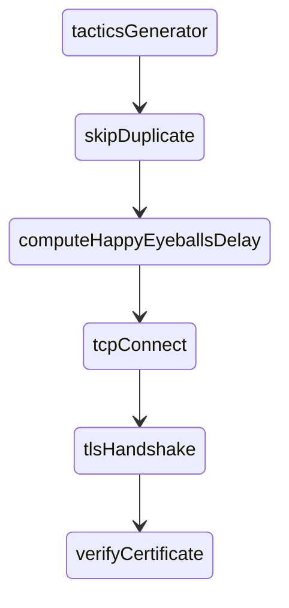

# Engine Network Extensions

This file documents the [./internal/enginenetx](.) package design. The content is current
as of [probe-cli#1552](https://github.com/ooni/probe-cli/pull/1552).

## Table of Contents

- [Goals & Assumptions](#goals--assumptions)
- [High-Level API](#high-level-api)
- [Creating TLS Connections](#creating-tls-connections)
- [Dialing Tactics](#dialing-tactics)
- [Dialing Algorithm](#dialing-algorithm)
- [Dialing Policies](#dialing-policies)
	- [dnsPolicy](#dnspolicy)
	- [userPolicy](#userpolicy)
	- [statsPolicy](#statspolicy)
	- [bridgePolicy](#bridgepolicy)
- [Managing Stats](#managing-stats)
- [Real-World Scenarios](#real-world-scenarios)
- [Limitations and Future Work](#limitations-and-future-work)

## Goals & Assumptions

We define "bridge" an IP address with the following properties:

1. the IP address is not expected to change frequently;

2. the IP address listens on port 443 and accepts _any_ incoming SNI;

3. the webserver on port 443 provides unified access to
[OONI API services](https://docs.ooni.org/backend/ooniapi/services/).

We also assume that the Web Connectivity test helpers (TH) could accept any SNIs.

We also define "tactic" a tactic to perform a TLS handshake either with a
bridge or with a TH. We also define "policy" the collection of algorithms for
producing tactics for performing TLS handshakes.

Considering all of this, this package aims to:

1. overcome DNS-based censorship for "api.ooni.io" by hardcoding known-good
bridges IP addresses inside the codebase to be used as a fallback;

2. overcome SNI-based censorship for "api.ooni.io" and test helpers by choosing
from a pre-defined list of SNIs as a fallback;

3. remember and use tactics for creating TLS connections that worked previously
and attempt to use them as a fallback;

4. for the trivial case, an uncensored API backend, communication to the API
should use the simplest way possible. This naturally leads to the fact that
it should recover ~quickly if the conditions change (e.g., if a bridge
is discontinued);

5. for users in censored regions it should be possible to use
tactics to overcome the restrictions;

6. when using tactics, try to defer sending the true `SNI` on the wire,
therefore trying to avoid triggering potential residual censorship blocking
a given TCP endpoint for some time regardless of what `SNI` is being used next;

7. allow users to force specific bridges and SNIs by editing
`$OONI_HOME/engine/bridges.conf`.

The rest of this document explains how we designed for achieving these goals.

## High-Level API

The purpose of the `enginenetx` package is to provide a `*Network` object from
which consumers can obtain a `model.HTTPTransport` and `*http.Client` to use
for HTTP operations:

```Go
func (n *Network) HTTPTransport() model.HTTPTransport
func (n *Network) NewHTTPClient() *http.Client
```

**Listing 1.** `*enginenetx.Network` HTTP APIs.

The `HTTPTransport` method returns a `*Network` field containing an HTTP
transport with custom TLS connection establishment tactics depending on the
configured policies.

The `NewHTTPClient` method wraps such a transport into an `*http.Client`.

## Creating TLS Connections

In [network.go](network.go), `newHTTPSDialerPolicy` configures the dialing policy
depending on the arguments passed to `NewNetwork`:

1. if the `proxyURL` argument is not `nil`, we use the `dnsPolicy` alone, since
we assume that the proxy knows how to do circumvention.

2. othwerwise, we compose policies as illustrated by the following diagram:

```
							+---------------+	+-----------------+
							| statsPolicyV2 |	| bridgesPolicyV2 |
			+------------------+		+---------------+	+-----------------+
			|     dnsPolicy    |			|			|
			+------------------+			| P			| F
					|			|			|
					V			V			V
				+-------------------+	+----------------------------------+
				| testHelpersPolicy |	|        mixPolicyInterleave<3>    |
				+-------------------+	+----------------------------------+
					|			|
					| P			| F
					|			|
					V			V
	+--------------+	+--------------------------------------+
	| userPolicyV2 |	|         mixPolicyInterleave<3>       |
	+--------------+	+--------------------------------------+
		|			|
		| P			| F
		|			|
		V			V
	+-----------------------------------+
	|           mixPolicyEitherOr       |
	+-----------------------------------+
			|
			V
```

**Diagram 1.** Sequence of policies constructed when not using a proxy.

In the above diagram, each block is a policy and each arrow is a Go channel. We
mark "primary" channels with "P" and "fallback" channels with "F".

Here's what each policy does:

1. `mixPolicyEitherOr`: if the primary channel returns tactics, just return
them, otherwise, just return tactics from the fallback.

2. `userPolicyV2`: returns tactics defined inside the `bridges.conf` file.

3. `mixPolicyInterleave<3>` read three from the primary, then three from
the fallback, then three from the primary, and continue alternating between
channels until both of them have been drained.

4. `testHelpersPolicy`: pass through each tactic it receives, then, if
the domain is a test helper domain, also generate tactics with additional
SNIs different from the test helper SNI.

5. `dnsPolicy`: use the DNS to generate tactics where the domain name
is also sent on the wire as the SNI.

6. `statsPolicyV2`: generate tactics based on what we know to be working.

7. `bridgesPolicyV2`: generate tactics using known bridges IP addresses
and SNIs different from the `api.ooni.io` SNI.

Until [probe-cli#1552](https://github.com/ooni/probe-cli/pull/1552), the whole
policy situation was much simpler and linear, but we changed that in such a
pull request to ensure the code was giving priority to DNS results.

## Dialing Tactics

Each policy implements the following interface
(defined in [httpsdialer.go](httpsdialer.go)):

```Go
type httpsDialerPolicy interface {
	LookupTactics(ctx context.Context, domain, port string) <-chan *httpsDialerTactic
}
```

**Listing 2.** Interface implemented by policies.

The `LookupTactics` operation is _conceptually_ similar to
[net.Resolver.LookupHost](https://pkg.go.dev/net#Resolver.LookupHost), because
both operations map a domain name to IP addresses to connect to. However,
there are also some key differences, namely:

1. `LookupTactics` is domain _and_ port specific, while `LookupHost`
only takes in input the domain name to resolve;

2. `LookupTactics` returns _a stream_ of viable "tactics", while `LookupHost`
returns a list of IP addresses (we define "stream" a channel where a background
goroutine posts content and which is closed when done).

The second point, in particular, is crucial. The design of `LookupTactics` is
such that we can start attempting to dial as soon as we have some tactics
to try. A composed `httpsDialerPolicy` can, in fact, start multiple child `LookupTactics`
operations and then return tactics to the caller as soon as some are ready, without
blocking dialing until _all_ the child operations are complete.

Also, as you may have guessed, the `dnsPolicy` is a policy that, under the hood,
eventually calls [net.Resolver.LookupHost](https://pkg.go.dev/net#Resolver.LookupHost)
to get IP addresses using the DNS used by the `*engine.Session` type. (Typically, such a
resolver, in turn, composes several DNS-over-HTTPS resolvers with the fallback
`getaddrinfo` resolver, and remembers which resolvers work.)

A "tactic" looks like this:

```Go
type httpsDialerTactic struct {
	Address string

	Port string

	SNI string

	VerifyHostname string
}
```

**Listing 3.** Structure describing a tactic.

Here's an explanation of why we have each field in the struct:

- `Address` and `Port` qualify the TCP endpoint;

- `SNI` is the `SNI` to send as part of the TLS ClientHello;

- `VerifyHostname` is the hostname to use for TLS certificate verification.

The separation of `SNI` and `VerifyHostname` is what allows us to send an innocuous
SNI over the network and then verify the certificate using the real SNI after a
`skipVerify=true` TLS handshake has completed. (Obviously, for this trick to work,
the HTTPS server we're using must be okay with receiving unrelated SNIs.)

## Dialing Algorithm

Creating TLS connections is implemented by `(*httpsDialer).DialTLSContext`, also
part of [httpsdialer.go](httpsdialer.go).

This method _morally_ does the following in ~parallel:



**Diagram 2.** Sequence of operations when dialing TLS connections.

Such a diagram roughly corresponds to this Go ~pseudo-code:

```Go
func (hd *httpsDialer) DialTLSContext(
	ctx context.Context, network string, endpoint string) (net.Conn, error) {
	// map to ensure we don't have duplicate tactics
	uniq := make(map[string]int)

	// time when we started dialing
	t0 := time.Now()

	// index of each dialing attempt
	idx := 0

	// [...] omitting code to get hostname and port from endpoint [...]

	// fetch tactics asynchronously
	for tx := range hd.policy.LookupTactics(ctx, hostname, port) {

		// avoid using the same tactic more than once
		summary := tx.tacticSummaryKey()
		if uniq[summary] > 0 {
			continue
		}
		uniq[summary]++

		// compute the happy eyeballs deadline
		deadline := t0.Add(happyEyeballsDelay(idx))
		idx++

		// dial in a background goroutine so this code runs in parallel
		go func(tx *httpsDialerTactic, deadline time.Duration) {
			// wait for deadline
			if delta := time.Until(deadline); delta > 0 {
				time.Sleep(delta)
			}

			// dial TCP
			conn, err := tcpConnect(tx.Address, tx.Port)

			// [...] omitting error handling and passing error to DialTLSContext [...]

			// handshake
			tconn, err := tlsHandshake(conn, tx.SNI, false /* skip verification */)

			// [...] omitting error handling and passing error to DialTLSContext [...]

			// make sure the hostname's OK
			err := verifyHostname(tconn, tx.VerifyHostname)

			// [...] omitting error handling and passing error or conn to DialTLSContext [...]

		}(tx, deadline)
	}

	// [...] omitting code to decide whether to return a conn or an error [...]
}
```

**Listing 4.** Algorithm implementing dialing TLS connections.

This simplified algorithm differs for the real implementation in that we
have omitted the following (boring) details:

1. code to obtain `hostname` and `port` from `endpoint` (e.g., code to extract
`"x.org"` and `"443"` from `"x.org:443"`);

2. code to pass back a connection or an error from a background
goroutine to the `DialTLSContext` method;

3. code to decide whether to return a `net.Conn` or an `error`;

4. the fact that `DialTLSContext` uses a goroutine pool rather than creating a
goroutine for each tactic;

5. the fact that, as soon as we successfully have a connection, we
immediately cancel any other parallel attempts.

The `happyEyeballsDelay` function (in [happyeyeballs.go](happyeyeballs.go)) is
such that we generate the following delays:

| idx | delay (s) |
| --- | --------- |
| 1   | 0         |
| 2   | 1         |
| 4   | 2         |
| 4   | 4         |
| 5   | 8         |
| 6   | 16        |
| 7   | 24        |
| 8   | 32        |
| ... | ...       |

**Table 1.** Happy-eyeballs-like delays.

That is, we exponentially increase the delay until `8s`, then we linearly increase by `8s`. We
aim to space attempts to accommodate for slow access networks
and/or access network experiencing temporary failures to deliver packets. However,
we also aim to have dialing parallelism, to reduce the overall time to connect
when we're experiencing many timeouts when attempting to dial.

(We chose 1s as the baseline delay because that would be ~three happy-eyeballs delays as
implemented by the Go standard library, and overall a TCP connect followed by a TLS
handshake should roughly amount to three round trips.)

Additionally, the `*httpsDialer` algorithm keeps statistics
using an `httpsDialerEventsHandler` type:

```Go
type httpsDialerEventsHandler interface {
	OnStarting(tactic *httpsDialerTactic)
	OnTCPConnectError(ctx context.Context, tactic *httpsDialerTactic, err error)
	OnTLSHandshakeError(ctx context.Context, tactic *httpsDialerTactic, err error)
	OnTLSVerifyError(tactic *httpsDialerTactic, err error)
	OnSuccess(tactic *httpsDialerTactic)
}
```

**Listing 5.** Interface for collecting statistics.

These statistics contribute to construct knowledge about the network
conditions and influence the generation of tactics.

## Dialing Policies

### dnsPolicy

The `dnsPolicy` is implemented by [dnspolicy.go](dnspolicy.go).

Its `LookupTactics` algorithm is quite simple:

1. we short circuit the cases in which the `domain` argument
contains an IP address to "resolve" exactly that IP address (thus emulating
what `getaddrinfo` would do when asked to "resolve" an IP address);

2. for each resolved address, we generate tactics where the `SNI` and
`VerifyHostname` equal the `domain`.

If `httpsDialer` uses this policy as its only policy, the operation it
performs are morally equivalent to normally dialing for TLS.

### userPolicy

The `userPolicy` is implemented by [userpolicy.go](userpolicy.go).

When constructing a `userPolicy` with `newUserPolicy` and read user policies
from the `$OONI_HOME/engine/bridges.conf` file.

As of 2024-04-16, the structure of `bridges.conf` is like in the following example:

```JavaScript
{
	"DomainEndpoints": {
		"api.ooni.io:443": [{
			"Address": "162.55.247.208",
			"Port": "443",
			"SNI": "www.example.com",
			"VerifyHostname": "api.ooni.io"
		}, {
			/* omitted */
		}]
	},
	"Version": 3
}
```

**Listing 6.** Sample `bridges.conf` content.

This example instructs to use the given tactic(s) when establishing a TLS connection to
`"api.ooni.io:443"`. If `bridges.conf` does not contain any entry, then this policy
would not know how to dial for a specific address and port.

The `newUserPolicy` constructor reads this file from disk on startup
and keeps its content in memory.

`LookupTactics` will:

1. check whether there's an entry for the given `domain` and `port`
inside the `DomainEndpoints` map;

2. if there are no entries, return zero tactics.

3. otherwise return all the tactic entries.

As shown in Diagram 1, because `userPolicy` is user-configured, we _entirely bypass_ the
fallback policy when there's an user-configured entry.

### statsPolicy

The `statsPolicy` is implemented by [statspolicy.go](statspolicy.go).

The general idea of this policy is that it depends on
a `*statsManager` that keeps persistent stats about tactics.

If we have stats about working tactics, we return them via the
channel, otherwise, there's nothing that we can return.

### bridgePolicy

The `bridgePolicy` is implemented by [bridgespolicy.go](bridgespolicy.go) and
rests on the assumptions made explicit above. That is:

1. that there is at least one _bridge_ for "api.ooni.io";

2. that the Web Connectivity Test Helpers accepts any SNI.

This policy will just generate tactics using well known IP addresses
and innocuous SNIs. When we are dialing for a domain different from
"api.ooni.io", this policy would return no tactics through the channel.

## Managing Stats

The [statsmanager.go](statsmanager.go) file implements the `*statsManager`.

We initialize the `*statsManager` by calling `newStatsManager` with a stats-trim
interval of 30 seconds in `NewNetwork` in [network.go](network.go).

The `*statsManager` keeps stats at `$OONI_HOME/engine/httpsdialerstats.state`.

In `newStatsManager`, we attempt to read this file using `loadStatsContainer` and, if
not present, we fall back to create empty stats with `newStatsContainer`.

While creating the `*statsManager` we also spawn a goroutine that trims the stats
at every stats-trimming interval by calling `(*statsManager).trim`. In turn, `trim`
calls `statsContainerPruneEntries`, which eventually:

1. removes entries not modified for more than one week;

2. sorts entries and only keeps the top 10 entries.

More specifically we sort entries using this algorithm:

1. by decreasing success rate; then

2. by decreasing number of successes; then

3. by decreasing last update time.

Likewise, calling `(*statsManager).Close` invokes `statsContainerPruneEntries`, and
then ensures that we write `$OONI_HOME/engine/httpsdialerstats.state`.

This way, subsequent OONI Probe runs could load the stats that are more likely
to work and `statsPolicy` can take advantage of this information.

The overall structure of `httpsdialerstats.state` is roughly the following:

```JavaScript
{
  "DomainEndpoints": {
    "api.ooni.io:443": {
      "Tactics": {
        "162.55.247.208:443 sni=api.trademe.co.nz verify=api.ooni.io": {
          "CountStarted": 58,
          "CountTCPConnectError": 0,
          "CountTCPConnectInterrupt": 0,
          "CountTCPConnectSuccess": 58,
          "CountTLSHandshakeError": 0,
          "CountTLSHandshakeInterrupt": 0,
          "CountTLSVerificationError": 0,
          "CountSuccess": 58,
          "HistoTCPConnectError": {},
          "HistoTLSHandshakeError": {},
          "HistoTLSVerificationError": {},
          "LastUpdated": "2024-04-15T10:38:53.575561+02:00",
          "Tactic": {
            "Address": "162.55.247.208",
            "InitialDelay": 0,
            "Port": "443",
            "SNI": "api.trademe.co.nz",
            "VerifyHostname": "api.ooni.io"
          }
        },
        /* ... */
      }
    }
  }
  "Version": 5
}
```

**Listing 7.** Content of the stats state as cached on disk.

That is, the `DomainEndpoints` map contains contains an entry for each
TLS endpoint and, in turn, such an entry contains tactics indexed by
a summary string to speed up looking them up.

For each tactic, we keep counters and histograms, the time when the
entry had been updated last, and the tactic itself.

The `*statsManager` implements `httpsDialerEventsHandler`, which means
that it has callbacks invoked by the `*httpsDialer` for interesting
events regarding dialing (e.g., whether TCP connect failed).

These callbacks basically create or update stats by locking a mutex
and updating the relevant counters and histograms.

## Real-World Scenarios

Because we always prioritize the DNS, the bridge becoming unavailable
has no impact on uncensored probes given that we try bridge based
strategies after we have tried all the DNS based strategies.

## Limitations and Future Work

1. We should integrate the [engineresolver](../engineresolver/) package with this package
more tightly: doing that would allow users to configure the order in which we use DNS-over-HTTPS
resolvers (see [probe#2675](https://github.com/ooni/probe/issues/2675)).

2. We lack a mechanism to dynamically distribute new bridges IP addresses to probes using,
for example, the check-in API and possibly other mechanisms. Lacking this functionality, our
bridge strategy is incomplete since it rests on a single bridge being available. What's
more, if this bridge disappears or is IP blocked, all the probes will have one slow bootstrap
and probes where DNS is not working will stop working (see
[probe#2500](https://github.com/ooni/probe/issues/2500)).

3. We should consider adding TLS ClientHello fragmentation as a tactic.

4. We should add support for HTTP/3 bridges.

5. We should redesign the dialing algorithm to react immediately to previous
failures rather than waiting the proper happy-eyeball time, like we also
did for the [httpclientx](../httpclientx/) package.

6. A previous implementation of this design had and explicit `InitialDelay`
field for a tactic. We are currently not using this field as we rewrite
the happy eyeballs delay unconditionally. Perhaps, we should keep the original
field value when reading user policies, to give users more control.

7. We should consider using existing knowledge from the stats to change
the SNI being used when using the DNS. This would make our knowledge about
what is working and not working much more effective than now.
