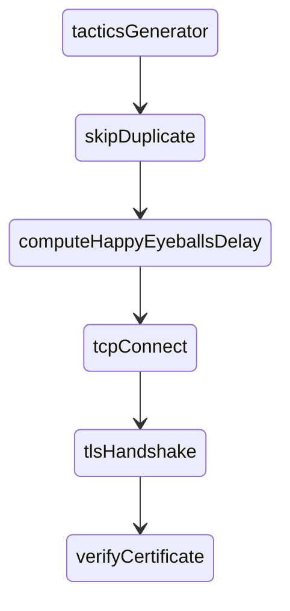
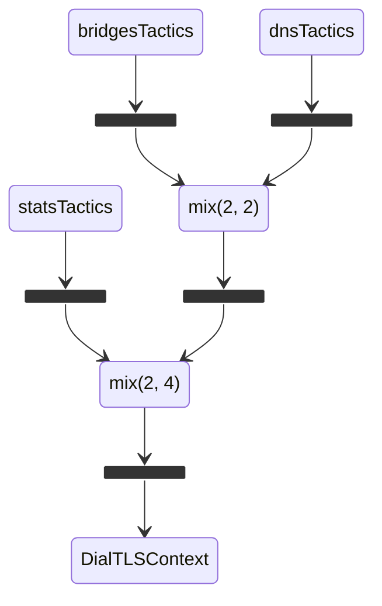

# Engine Network Extensions

This file documents the [./internal/enginenetx](.) package design. The content is current
as of [probe-cli#1552](https://github.com/ooni/probe-cli/pull/1552).

## Table of Contents

- [Goals & Assumptions](#goals--assumptions)
- [High-Level API](#high-level-api)
- [Creating TLS Connections](#creating-tls-connections)
- [Dialing Tactics](#dialing-tactics)
- [Dialing Algorithm](#dialing-algorithm)
- [Dialing Policies](#dialing-policies)
	- [dnsPolicy](#dnspolicy)
	- [userPolicy](#userpolicy)
	- [statsPolicy](#statspolicy)
	- [bridgePolicy](#bridgepolicy)
- [Overall Algorithm](#overall-algorithm)
- [Managing Stats](#managing-stats)
- [Real-World Scenarios](#real-world-scenarios)
	- [Invalid bridge without cached data](#invalid-bridge-without-cached-data)
	- [Invalid bridge with cached data](#invalid-bridge-with-cached-data)
	- [Valid bridge with invalid cached data](#valid-bridge-with-invalid-cached-data)
- [Limitations and Future Work](#limitations-and-future-work)

## Goals & Assumptions

We define "bridge" an IP address with the following properties:

1. the IP address is not expected to change frequently;

2. the IP address listens on port 443 and accepts _any_ incoming SNI;

3. the webserver on port 443 provides unified access to [OONI API services](https://docs.ooni.org/backend/ooniapi/services/).

We also assume that the Web Connectivity test helpers (TH) could accept any SNIs.

We also define "tactic" a tactic to perform a TLS handshake either with a
bridge or with a TH. We also define "policy" the collection of algorithms for
producing tactics for performing TLS handshakes.

Considering all of this, this package aims to:

1. overcome DNS-based censorship for "api.ooni.io" by hardcoding known-good
bridges IP addresses inside the codebase;

2. overcome SNI-based censorship for "api.ooni.io" and test helpers by choosing
from a pre-defined list of SNIs;

3. remember and use tactics for creating TLS connections that worked previously;

4. for the trivial case, an uncensored API backend, communication to the API should use the simplest way possible. This naturally leads to the fact that it should recover ~quickly if the conditions change (e.g., if a bridge is discontinued);

5. for users in censored regions it should be possible to use tactics to overcome the restrictions;

6. try to defer sending the true `SNI` on the wire, therefore trying to
avoid triggering potential residual censorship blocking a given TCP endpoint
for some time regardless of what `SNI` is being used next;

7. allow users to force specific bridges and SNIs by editing `$OONI_HOME/engine/bridges.conf`.

The rest of this document explains how we designed for achieving these goals.

## High-Level API

The purpose of the `enginenetx` package is to provide a `*Network` object from which consumers
can obtain a `model.HTTPTransport` and `*http.Client` for HTTP operations:

```Go
func (n *Network) HTTPTransport() model.HTTPTransport
func (n *Network) NewHTTPClient() *http.Client
```

**Listing 1.** `*enginenetx.Network` HTTP APIs.

The `HTTPTransport` method returns a `*Network` field containing an HTTP transport with
custom TLS connection establishment tactics depending on the configured policies.

The `NewHTTPClient` method wraps such a transport into an `*http.Client`.

## Creating TLS Connections

In [network.go](network.go), `newHTTPSDialerPolicy` configures the dialing policy
depending on the arguments passed to `NewNetwork`:

1. if the `proxyURL` argument is not `nil`, we use the `dnsPolicy` alone;

2. othwerwise, we compose policies as illustrated by the following diagram:

```
+------------+     +-------------+     +--------------+     +-----------+
| userPolicy | --> | statsPolicy | --> | bridgePolicy | --> | dnsPolicy |
+------------+     +-------------+     +--------------+     +-----------+
```

**Diagram 1.** Sequence of policies constructed when not using a proxy.

Policies are described in detail in subsequent sections. On a high-level, here's what each does:

1. `userPolicy`: honours the `bridges.conf` configuration file and, if no entry is found
inside it, then it falls back to the subsequent policy;

2. `statsPolicy`: uses statistics collected from previous runs to select tactics that
worked recently for specific dialing targets, otherwise it falls back to the subsequent policy;

3. `bridgePolicy`: adopts a bridge strategy for `api.ooni.io` (i.e., uses known-in-advance
IP addresses), and otherwise falls back to the subsequent policy, still taking care of
hiding the THs SNIs;

4. `dnsPolicy`: uses the `*engine.Session` DNS resolver to lookup domain names
and produces trivial tactics equivalent to connecting normally using the Go standard library.

While the previous description says "falls back to," the actual semantics of falling
back is more complex than just falling back. For `statsPolicy` and `bridgePolicy`,
we remix the current policy strategy and subsequent policies strategies to strike a
balance between what a policy suggests and what subsequent policies would suggest. In
turn, this reduces the overall bootstrap time in light of issues with policies. (We
added remix as part of [probe-cli#1552](https://github.com/ooni/probe-cli/pull/1552); before,
we implemented strict falling back.)

Also, when using a proxy, we just use `dnsPolicy` assuming the proxy knows how to do circumvention.

## Dialing Tactics

Each policy implements the following interface (defined in [httpsdialer.go](httpsdialer.go)):

```Go
type httpsDialerPolicy interface {
	LookupTactics(ctx context.Context, domain, port string) <-chan *httpsDialerTactic
}
```

**Listing 2.** Interface implemented by policies.

The `LookupTactics` operation is _conceptually_ similar to
[net.Resolver.LookupHost](https://pkg.go.dev/net#Resolver.LookupHost), because
both operations map a domain name to IP addresses to connect to. However,
there are also some key differences, namely:

1. `LookupTactics` is domain _and_ port specific, while `LookupHost`
only takes in input the domain name to resolve;

2. `LookupTactics` returns _a stream_ of viable "tactics", while `LookupHost`
returns a list of IP addresses (we define "stream" a channel where a background
goroutine posts content and which is closed when done).

The second point, in particular, is crucial. The design of `LookupTactics` is
such that we can start attempting to dial as soon as we have some tactics
to try. A composed `httpsDialerPolicy` can, in fact, start multiple child `LookupTactics`
operations and then return tactics to the caller as soon as some are ready, without
blocking dialing until _all_ the child operations are complete.

Also, as you may have guessed, the `dnsPolicy` is a policy that, under the hood,
eventually calls [net.Resolver.LookupHost](https://pkg.go.dev/net#Resolver.LookupHost)
to get IP addresses using the DNS used by the `*engine.Session` type. (Typically, such a
resolver, in turn, composes several DNS-over-HTTPS resolvers with the fallback
`getaddrinfo` resolver, and remembers which resolvers work.)

A "tactic" looks like this:

```Go
type httpsDialerTactic struct {
	Address        string
	InitialDelay   time.Duration
	Port           string
	SNI            string
	VerifyHostname string
}
```

**Listing 3.** Structure describing a tactic.

Here's an explanation of why we have each field in the struct:

- `Address` and `Port` qualify the TCP endpoint;

- `InitialDelay` allows a policy to delay a connect operation to implement
something similar to [happy eyeballs](https://en.wikipedia.org/wiki/Happy_Eyeballs),
where dialing attempts run in parallel and are staggered in time (the classical
example being: dialing for IPv6 and then attempting dialing for IPv4 after 0.3s);

- `SNI` is the `SNI` to send as part of the TLS ClientHello;

- `VerifyHostname` is the hostname to use for TLS certificate verification.

The separation of `SNI` and `VerifyHostname` is what allows us to send an innocuous
SNI over the network and then verify the certificate using the real SNI after a
`skipVerify=true` TLS handshake has completed. (Obviously, for this trick to work,
the HTTPS server we're using must be okay with receiving unrelated SNIs.)

## Dialing Algorithm

Creating TLS connections is implemented by `(*httpsDialer).DialTLSContext`, also
part of [httpsdialer.go](httpsdialer.go).

This method _morally_ does the following in ~parallel:



**Diagram 2.** Sequence of operations when dialing TLS connections.

Such a diagram roughly corresponds to this Go ~pseudo-code:

```Go
func (hd *httpsDialer) DialTLSContext(
	ctx context.Context, network string, endpoint string) (net.Conn, error) {
	// map to ensure we don't have duplicate tactics
	uniq := make(map[string]int)

	// time when we started dialing
	t0 := time.Now()

	// index of each dialing attempt
	idx := 0

	// [...] omitting code to get hostname and port from endpoint [...]

	// fetch tactics asynchronously
	for tx := range hd.policy.LookupTactics(ctx, hostname, port) {

		// avoid using the same tactic more than once
		summary := tx.tacticSummaryKey()
		if uniq[summary] > 0 {
			continue
		}
		uniq[summary]++

		// compute the happy eyeballs deadline
		deadline := t0.Add(happyEyeballsDelay(idx))
		idx++

		// dial in a background goroutine so this code runs in parallel
		go func(tx *httpsDialerTactic, deadline time.Duration) {
			// wait for deadline
			if delta := time.Until(deadline); delta > 0 {
				time.Sleep(delta)
			}

			// dial TCP
			conn, err := tcpConnect(tx.Address, tx.Port)

			// [...] omitting error handling and passing error to DialTLSContext [...]

			// handshake
			tconn, err := tlsHandshake(conn, tx.SNI, false /* skip verification */)

			// [...] omitting error handling and passing error to DialTLSContext [...]

			// make sure the hostname's OK
			err := verifyHostname(tconn, tx.VerifyHostname)

			// [...] omitting error handling and passing error or conn to DialTLSContext [...]

		}(tx, deadline)
	}

	// [...] omitting code to decide whether to return a conn or an error [...]
}
```

**Listing 4.** Algorithm implementing dialing TLS connections.

This simplified algorithm differs for the real implementation in that we
have omitted the following (boring) details:

1. code to obtain `hostname` and `port` from `endpoint` (e.g., code to extract
`"x.org"` and `"443"` from `"x.org:443"`);

2. code to pass back a connection or an error from a background
goroutine to the `DialTLSContext` method;

3. code to decide whether to return a `net.Conn` or an `error`;

4. the fact that `DialTLSContext` uses a goroutine pool rather than creating a
goroutine for each tactic;

5. the fact that, as soon as we successfully have a connection, we
immediately cancel any other parallel attempts.

The `happyEyeballsDelay` function (in [happyeyeballs.go](happyeyeballs.go)) is
such that we generate the following delays:

| idx | delay (s) |
| --- | --------- |
| 1   | 0         |
| 2   | 1         |
| 4   | 2         |
| 4   | 4         |
| 5   | 8         |
| 6   | 16        |
| 7   | 24        |
| 8   | 32        |
| ... | ...       |

**Table 1.** Happy-eyeballs-like delays.

That is, we exponentially increase the delay until `8s`, then we linearly increase by `8s`. We
aim to space attempts to accommodate for slow access networks
and/or access network experiencing temporary failures to deliver packets. However,
we also aim to have dialing parallelism, to reduce the overall time to connect
when we're experiencing many timeouts when attempting to dial.

(We chose 1s as the baseline delay because that would be ~three happy-eyeballs delays as
implemented by the Go standard library, and overall a TCP connect followed by a TLS
handshake should roughly amount to three round trips.)

Additionally, the `*httpsDialer` algorithm keeps statistics
using an `httpsDialerEventsHandler` type:

```Go
type httpsDialerEventsHandler interface {
	OnStarting(tactic *httpsDialerTactic)
	OnTCPConnectError(ctx context.Context, tactic *httpsDialerTactic, err error)
	OnTLSHandshakeError(ctx context.Context, tactic *httpsDialerTactic, err error)
	OnTLSVerifyError(tactic *httpsDialerTactic, err error)
	OnSuccess(tactic *httpsDialerTactic)
}
```

**Listing 5.** Interface for collecting statistics.

These statistics contribute to construct knowledge about the network
conditions and influence the generation of tactics.

## Dialing Policies

### dnsPolicy

The `dnsPolicy` is implemented by [dnspolicy.go](dnspolicy.go).

Its `LookupTactics` algorithm is quite simple:

1. we short circuit the cases in which the `domain` argument
contains an IP address to "resolve" exactly that IP address (thus emulating
what `getaddrinfo` would do when asked to "resolve" an IP address);

2. for each resolved address, we generate tactics where the `SNI` and
`VerifyHostname` equal the `domain`.

If `httpsDialer` uses this policy as its only policy, the operation it
performs are morally equivalent to normally dialing for TLS.

### userPolicy

The `userPolicy` is implemented by [userpolicy.go](userpolicy.go).

When constructing a `userPolicy` with `newUserPolicy` we indicate a fallback
`httpsDialerPolicy` to use as the fallback, when either `$OONI_HOME/engine/bridges.conf`
does not exist or it does not contain actionable dialing rules.

As of 2024-04-16, the structure of `bridges.conf` is like in the following example:

```JavaScript
{
	"DomainEndpoints": {
		"api.ooni.io:443": [{
			"Address": "162.55.247.208",
			"Port": "443",
			"SNI": "www.example.com",
			"VerifyHostname": "api.ooni.io"
		}, {
			/* omitted */
		}]
	},
	"Version": 3
}
```

**Listing 6.** Sample `bridges.conf` content.

This example instructs to use the given tactic(s) when establishing a TLS connection to
`"api.ooni.io:443"`. Any other destination hostname and port would instead use the
configured "fallback" dialing policy.

The `newUserPolicy` constructor reads this file from disk on startup
and keeps its content in memory.

`LookupTactics` will:

1. check whether there's an entry for the given `domain` and `port`
inside the `DomainEndpoints` map;

2. if there are no entries, fallback to the fallback `httpsDialerPolicy`;

3. otherwise return all the tactic entries.

Because `userPolicy` is user-configured, we _entirely bypass_ the
fallback policy when there's an user-configured entry.

### statsPolicy

The `statsPolicy` is implemented by [statspolicy.go](statspolicy.go).

The general idea of this policy is that it depends on:

1. a `*statsManager` that keeps persistent stats about tactics;

2. a "fallback" policy.

In principle, one would expect `LookupTactics` to first return all
the tactics we can see from the stats and then try tactics obtained
from the fallback policy. However, this simplified algorithm would
lead to suboptimal results in the following case:

1. say there are 10 tactics for "api.ooni.io:443" that are bound
to a specific bridge address that has been discontinued;

2. if we try all these 10 tactics before trying fallback tactics, we
would waste lots of time failing before falling back.

Conversely, a better strategy is to "remix" tactics as implemented
by the [mix.go](mix.go) file:

1. we take the first two tactics from the stats;

2. then we take the first four tactics from the fallback;

3. then we remix the rest, not caring much about whether we're
reading from the stats of from the fallback.

Because we sort tactics from the stats by our understanding of whether
they are working as intended, we'll prioritize what we know to be working,
but then we'll also throw some new tactics into the mix. (We read four
tactics from the fallback because that allows us to include two bridge tactics
and two DNS tactics, as explained below when we discuss the
`bridgePolicy` policy.)

### bridgePolicy

The `bridgePolicy` is implemented by [bridgespolicy.go](bridgespolicy.go) and
rests on the assumptions made explicit above. That is:

1. that there is at least one _bridge_ for "api.ooni.io";

2. that the Web Connectivity Test Helpers accepts any SNI.

Here we're also using the [mix.go](mix.go) algorithm to remix
two different sources of tactics:

1. the `bridgesTacticsForDomain` only returns tactics for "api.ooni.io"
using existing knowledge of bridges and random SNIs;

2. the `maybeRewriteTestHelpersTactics` method filters the results
coming from the fallback tactic such that, if we are connecting
to a known test-helper domain name, we're trying to hide its SNI.

The first two returned tactics will be bridges tactics for "api.ooni.io",
if applicable, followed by two tactics generated using the DNS,
followed by a random remix of all the remaining tactics. This choice of
returning two and two tactics first, is the
reason why in `statsPolicy` we return the first four tactics from
the fallback after getting two tactics from the stats.

## Overall Algorithm

The composed policy is as described in Diagram 1.

Therefore, the compose policy will return the following tactics:


1. if there is a `$OONI_HOME/engine/bridges.conf` with a valid entry,
use it without trying more tactics; otherwise,

2. use the first two tactics coming from stats, if any;

3. then use the first two tactics coming from bridges, if any;

4. then use the first two tactics coming from the DNS, if successful;

5. finally, randomly remix the remaining tactics.

Excluding the case where we have a valid entry in `bridges.conf`, the following
diagram illustrates how we're mixing tactics:



**Diagram 3.** Tactics generation priorities when not using a proxy.

Here `mix(X, Y)` means taking `X` from the left block, if possible, then `Y` from the
right block, if possible, and then mixing the remainder in random order. Also, the "join"
blocks in the diagram represent Go channels.

Having discussed this, it only remains to discuss managing stats.

## Managing Stats

The [statsmanager.go](statsmanager.go) file implements the `*statsManager`.

We initialize the `*statsManager` by calling `newStatsManager` with a stats-trim
interval of 30 seconds in `NewNetwork` in [network.go](network.go).

The `*statsManager` keeps stats at `$OONI_HOME/engine/httpsdialerstats.state`.

In `newStatsManager`, we attempt to read this file using `loadStatsContainer` and, if
not present, we fall back to create empty stats with `newStatsContainer`.

While creating the `*statsManager` we also spawn a goroutine that trims the stats
at every stats-trimming interval by calling `(*statsManager).trim`. In turn, `trim`
calls `statsContainerPruneEntries`, which eventually:

1. removes entries not modified for more than one week;

2. sorts entries and only keeps the top 10 entries.

More specifically we sort entries using this algorithm:

1. by decreasing success rate; then

2. by decreasing number of successes; then

3. by decreasing last update time.

Likewise, calling `(*statsManager).Close` invokes `statsContainerPruneEntries`, and
then ensures that we write `$OONI_HOME/engine/httpsdialerstats.state`.

This way, subsequent OONI Probe runs could load the stats that are more likely
to work and `statsPolicy` can take advantage of this information.

The overall structure of `httpsdialerstats.state` is roughly the following:

```JavaScript
{
  "DomainEndpoints": {
    "api.ooni.io:443": {
      "Tactics": {
        "162.55.247.208:443 sni=api.trademe.co.nz verify=api.ooni.io": {
          "CountStarted": 58,
          "CountTCPConnectError": 0,
          "CountTCPConnectInterrupt": 0,
          "CountTCPConnectSuccess": 58,
          "CountTLSHandshakeError": 0,
          "CountTLSHandshakeInterrupt": 0,
          "CountTLSVerificationError": 0,
          "CountSuccess": 58,
          "HistoTCPConnectError": {},
          "HistoTLSHandshakeError": {},
          "HistoTLSVerificationError": {},
          "LastUpdated": "2024-04-15T10:38:53.575561+02:00",
          "Tactic": {
            "Address": "162.55.247.208",
            "InitialDelay": 0,
            "Port": "443",
            "SNI": "api.trademe.co.nz",
            "VerifyHostname": "api.ooni.io"
          }
        },
        /* ... */
      }
    }
  }
  "Version": 5
}
```

**Listing 7.** Content of the stats state as cached on disk.

That is, the `DomainEndpoints` map contains contains an entry for each
TLS endpoint and, in turn, such an entry contains tactics indexed by
a summary string to speed up looking them up.

For each tactic, we keep counters and histograms, the time when the
entry had been updated last, and the tactic itself.

The `*statsManager` implements `httpsDialerEventsHandler`, which means
that it has callbacks invoked by the `*httpsDialer` for interesting
events regarding dialing (e.g., whether TCP connect failed).

These callbacks basically create or update stats by locking a mutex
and updating the relevant counters and histograms.

## Real-World Scenarios

This section illustrates the behavior of this package under specific
network failure conditions, with specific emphasis on what happens if
the bridge IP address becomes, for any reason, unavailable. (We are
doing this because all this work was prompeted by addressing the
[ooni/probe#2704](https://github.com/ooni/probe/issues/2704) issue.)

### Invalid bridge without cached data

In this first scenario, we're showing what happens if the bridge IP address
becomes unavailable without any previous state saved on disk. (To emulate
this scenario, change the bridge IP address in [bridgespolicy.go](bridgespolicy.go)
to become `10.0.0.1`, recompile, and wipe `httpsdialerstats.state`).

Here's an excerpt from the logs:

```
[      0.001346] <info> httpsDialer: [#1] TCPConnect 10.0.0.1:443... started
[      0.002101] <info> sessionresolver: lookup api.ooni.io using https://wikimedia-dns.org/dns-query... started
[      0.264132] <info> sessionresolver: lookup api.ooni.io using https://wikimedia-dns.org/dns-query... ok
[      0.501774] <info> httpsDialer: [#1] TCPConnect 10.0.0.1:443... in progress
[      1.002330] <info> httpsDialer: [#2] TCPConnect 10.0.0.1:443... started
[      1.503687] <info> httpsDialer: [#2] TCPConnect 10.0.0.1:443... in progress
[      2.001488] <info> httpsDialer: [#4] TCPConnect 162.55.247.208:443... started
[      2.046917] <info> httpsDialer: [#4] TCPConnect 162.55.247.208:443... ok
[      2.047016] <info> httpsDialer: [#4] TLSHandshake with 162.55.247.208:443 SNI=api.ooni.io ALPN=[h2 http/1.1]... started
[      2.093148] <info> httpsDialer: [#4] TLSHandshake with 162.55.247.208:443 SNI=api.ooni.io ALPN=[h2 http/1.1]... ok
[      2.093181] <info> httpsDialer: [#4] TLSVerifyCertificateChain api.ooni.io... started
[      2.095923] <info> httpsDialer: [#4] TLSVerifyCertificateChain api.ooni.io... ok
[      2.096054] <info> httpsDialer: [#1] TCPConnect 10.0.0.1:443... interrupted
[      2.096077] <info> httpsDialer: [#2] TCPConnect 10.0.0.1:443... interrupted
```

**Listing 8.** Run with no previous cached state and unreachable hardcoded bridge address.

After 2s, we start dialing with the IP addresses obtained through the DNS.

Subsequent runs will cache this information on disk and use it.

### Invalid bridge with cached data

This scenario is like the previous one, however we also assume that we have
a cached `httpsdialerstats.state` containing now-invalid lines. To this
end, we replace the original file with this content:

```JSON
{
  "DomainEndpoints": {
    "api.ooni.io:443": {
      "Tactics": {
        "10.0.0.1:443 sni=static-tracking.klaviyo.com verify=api.ooni.io": {
          "CountStarted": 1,
          "CountTCPConnectError": 0,
          "CountTCPConnectInterrupt": 0,
          "CountTLSHandshakeError": 0,
          "CountTLSHandshakeInterrupt": 0,
          "CountTLSVerificationError": 0,
          "CountSuccess": 1,
          "HistoTCPConnectError": {},
          "HistoTLSHandshakeError": {},
          "HistoTLSVerificationError": {},
          "LastUpdated": "2024-04-16T16:04:34.398778+02:00",
          "Tactic": {
            "Address": "10.0.0.1",
            "InitialDelay": 0,
            "Port": "443",
            "SNI": "static-tracking.klaviyo.com",
            "VerifyHostname": "api.ooni.io"
          }
        },
        "10.0.0.1:443 sni=vidstat.taboola.com verify=api.ooni.io": {
          "CountStarted": 1,
          "CountTCPConnectError": 0,
          "CountTCPConnectInterrupt": 0,
          "CountTLSHandshakeError": 0,
          "CountTLSHandshakeInterrupt": 0,
          "CountTLSVerificationError": 0,
          "CountSuccess": 1,
          "HistoTCPConnectError": {},
          "HistoTLSHandshakeError": {},
          "HistoTLSVerificationError": {},
          "LastUpdated": "2024-04-16T16:04:34.398795+02:00",
          "Tactic": {
            "Address": "10.0.0.1",
            "InitialDelay": 1000000000,
            "Port": "443",
            "SNI": "vidstat.taboola.com",
            "VerifyHostname": "api.ooni.io"
          }
        },
        "10.0.0.1:443 sni=www.example.com verify=api.ooni.io": {
          "CountStarted": 1,
          "CountTCPConnectError": 0,
          "CountTCPConnectInterrupt": 0,
          "CountTLSHandshakeError": 0,
          "CountTLSHandshakeInterrupt": 0,
          "CountTLSVerificationError": 0,
          "CountSuccess": 1,
          "HistoTCPConnectError": {},
          "HistoTLSHandshakeError": {},
          "HistoTLSVerificationError": {},
          "LastUpdated": "2024-04-16T16:04:34.398641+02:00",
          "Tactic": {
            "Address": "10.0.0.1",
            "InitialDelay": 2000000000,
            "Port": "443",
            "SNI": "www.example.com",
            "VerifyHostname": "api.ooni.io"
          }
        }
      }
    }
  },
  "Version": 5
}
```

**Listing 9.** Cached state for run with invalid cached state and invalid bridge address.

Here's an excerpt from the logs:

```
[      0.004017] <info> sessionresolver: lookup api.ooni.io using https://wikimedia-dns.org/dns-query... started
[      0.003854] <info> httpsDialer: [#2] TCPConnect 10.0.0.1:443... started
[      0.108089] <info> sessionresolver: lookup api.ooni.io using https://wikimedia-dns.org/dns-query... ok
[      0.505472] <info> httpsDialer: [#2] TCPConnect 10.0.0.1:443... in progress
[      1.004614] <info> httpsDialer: [#1] TCPConnect 10.0.0.1:443... started
[      1.506069] <info> httpsDialer: [#1] TCPConnect 10.0.0.1:443... in progress
[      2.003650] <info> httpsDialer: [#3] TCPConnect 10.0.0.1:443... started
[      2.505130] <info> httpsDialer: [#3] TCPConnect 10.0.0.1:443... in progress
[      4.004683] <info> httpsDialer: [#4] TCPConnect 10.0.0.1:443... started
[      4.506176] <info> httpsDialer: [#4] TCPConnect 10.0.0.1:443... in progress
[      8.004547] <info> httpsDialer: [#5] TCPConnect 162.55.247.208:443... started
[      8.042946] <info> httpsDialer: [#5] TCPConnect 162.55.247.208:443... ok
[      8.043015] <info> httpsDialer: [#5] TLSHandshake with 162.55.247.208:443 SNI=api.ooni.io ALPN=[h2 http/1.1]... started
[      8.088383] <info> httpsDialer: [#5] TLSHandshake with 162.55.247.208:443 SNI=api.ooni.io ALPN=[h2 http/1.1]... ok
[      8.088417] <info> httpsDialer: [#5] TLSVerifyCertificateChain api.ooni.io... started
[      8.091007] <info> httpsDialer: [#5] TLSVerifyCertificateChain api.ooni.io... ok
[      8.091174] <info> httpsDialer: [#1] TCPConnect 10.0.0.1:443... interrupted
[      8.091234] <info> httpsDialer: [#3] TCPConnect 10.0.0.1:443... interrupted
[      8.091258] <info> httpsDialer: [#2] TCPConnect 10.0.0.1:443... interrupted
[      8.091324] <info> httpsDialer: [#4] TCPConnect 10.0.0.1:443... interrupted
```

**Listing 10.** Run with invalid cached state and invalid bridge address.

So, here the fifth attempt is using the DNS. This is in line with the mixing algorithm, where
the first four attempt come from the stats or from the bridge policies.

Let's also shows what happens if we repeat the bootstrap:

```
[      0.000938] <info> httpsDialer: [#2] TCPConnect 162.55.247.208:443... started
[      0.001014] <info> sessionresolver: lookup api.ooni.io using https://mozilla.cloudflare-dns.com/dns-query... started
[      0.053325] <info> httpsDialer: [#2] TCPConnect 162.55.247.208:443... ok
[      0.053355] <info> httpsDialer: [#2] TLSHandshake with 162.55.247.208:443 SNI=api.ooni.io ALPN=[h2 http/1.1]... started
[      0.080695] <info> sessionresolver: lookup api.ooni.io using https://mozilla.cloudflare-dns.com/dns-query... ok
[      0.094648] <info> httpsDialer: [#2] TLSHandshake with 162.55.247.208:443 SNI=api.ooni.io ALPN=[h2 http/1.1]... ok
[      0.094662] <info> httpsDialer: [#2] TLSVerifyCertificateChain api.ooni.io... started
[      0.096677] <info> httpsDialer: [#2] TLSVerifyCertificateChain api.ooni.io... ok
```

**Listing 11.** Re-run with invalid cached state and bridge address.

You see that now we immediately use the correct address thanks to the stats.

### Valid bridge with invalid cached data

In this scenario, the bridge inside [bridgespolicy.go](bridgespolicy.go) is valid
but we have a cache listing an invalid bridge (I modified my cache to use `10.0.0.1`).

Here's an excerpt from the logs:

```
[      0.002641] <info> sessionresolver: lookup api.ooni.io using https://mozilla.cloudflare-dns.com/dns-query... started
[      0.081401] <info> sessionresolver: lookup api.ooni.io using https://mozilla.cloudflare-dns.com/dns-query... ok
[      0.503518] <info> httpsDialer: [#1] TCPConnect 10.0.0.1:443... in progress
[      1.005322] <info> httpsDialer: [#2] TCPConnect 10.0.0.1:443... started
[      1.506304] <info> httpsDialer: [#2] TCPConnect 10.0.0.1:443... in progress
[      2.002837] <info> httpsDialer: [#4] TCPConnect 162.55.247.208:443... started
[      2.048721] <info> httpsDialer: [#4] TCPConnect 162.55.247.208:443... ok
[      2.048760] <info> httpsDialer: [#4] TLSHandshake with 162.55.247.208:443 SNI=player.ex.co ALPN=[h2 http/1.1]... started
[      2.091016] <info> httpsDialer: [#4] TLSHandshake with 162.55.247.208:443 SNI=player.ex.co ALPN=[h2 http/1.1]... ok
[      2.091033] <info> httpsDialer: [#4] TLSVerifyCertificateChain api.ooni.io... started
[      2.093542] <info> httpsDialer: [#4] TLSVerifyCertificateChain api.ooni.io... ok
[      2.093708] <info> httpsDialer: [#2] TCPConnect 10.0.0.1:443... interrupted
[      2.093718] <info> httpsDialer: [#1] TCPConnect 10.0.0.1:443... interrupted
```

**Listing 12.** Re with invalid cached state and valid bridge address.

In this case, we pick up the right bridge configuration and successfully
use it after two seconds. This configuration is provided by the `bridgesPolicy`.

## Limitations and Future Work

1. We should integrate the [engineresolver](../engineresolver/) package with this package
more tightly: doing that would allow users to configure the order in which we use DNS-over-HTTPS
resolvers (see [probe#2675](https://github.com/ooni/probe/issues/2675)).

2. We lack a mechanism to dynamically distribute new bridges IP addresses to probes using,
for example, the check-in API and possibly other mechanisms. Lacking this functionality, our
bridge strategy is incomplete since it rests on a single bridge being available. What's
more, if this bridge disappears or is IP blocked, all the probes will have one slow bootstrap
and probes where DNS is not working will stop working (see
[probe#2500](https://github.com/ooni/probe/issues/2500)).

3. We should consider adding TLS ClientHello fragmentation as a tactic.

4. We should add support for HTTP/3 bridges.
