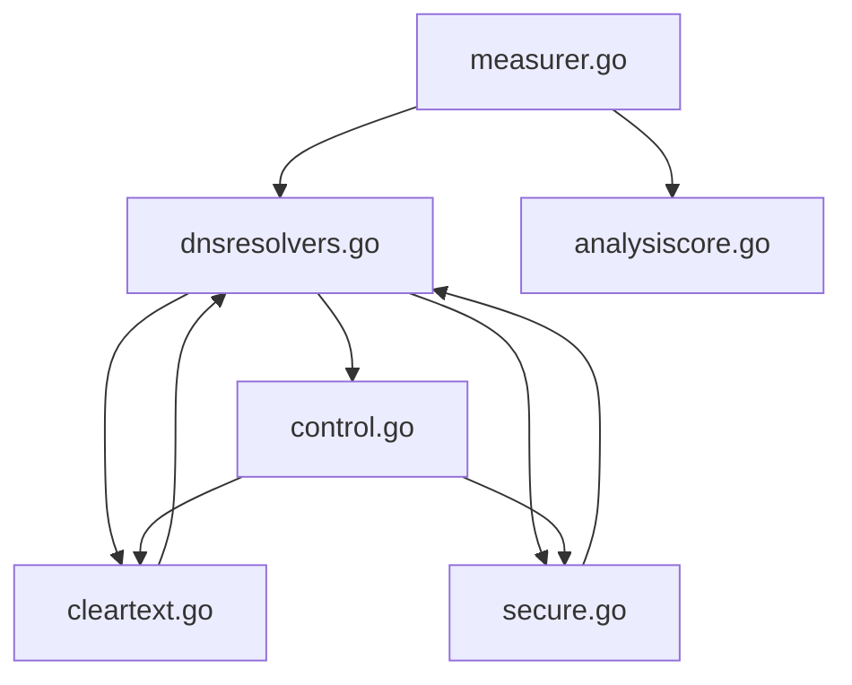

# webconnectivity

This directory contains a new implementation of [Web Connectivity](
https://github.com/ooni/spec/blob/master/nettests/ts-017-web-connectivity.md).

As of 2022-09-15, this code is experimental and is not selected
by default when you run the `websites` group. You can select this
implementation with `miniooni` using `miniooni web_connectivity@v0.5`
from the command line.

Issue [#2237](https://github.com/ooni/probe/issues/2237) explains the rationale
behind writing this new implementation.

## Implementation overview

<b>Figure I</b>. Relationship between files in this implementation

The experiment measures a single URL at a time. The OONI Engine invokes the
`Run` method inside the [measurer.go](measurer.go) file.

The first task that `Run` starts deals with DNS and lives in the
[dnsresolvers.go](dnsresolvers.go) file. This task is responsible for
resolving the domain inside the URL into `0..N` IP addresses.
The domain resolution includes the system resolver and a DNS-over-UDP
resolver. The implementaion _may_ do more than that, but this is the
bare minimum we're feeling like documenting right now. (We need to
experiment a bit more to understand what else we can do there, hence
the code is _probably_ doing more than just that.)

Once we know the `0..N` IP addresses for the domain we do the following:

1. start a background task to communicate with the Web Connectivity
test helper, using code inside [control.go](control.go);

2. start an endpoint measurement task for each IP adddress (which of
course only happens when we know _at least_ one addr).

Regarding starting endpoint measurements, we follow this policy:

1. if the original URL is `http://...` then, for each address, we start
an HTTP task using port `80` and an HTTPS task using `443`.

2. if it's `https://...`, then we only start HTTPS tasks.

HTTP tasks are implemented by [cleartextflow.go](cleartextflow.go) while
the HTTPS tasks live in [secureflow.go](secureflow.go).

An HTTP task does the following:

1. TCP connect;

2. additionally, the first task to establish a connection also performs
a GET request to fetch a webpage (we cannot GET for all connections, because
that would be `websteps` and would require a different data format).

An HTTPS task does the following:

1. TCP connect;

2. TLS handshake;

3. additionally, the first task to handshake also performs
a GET request to fetch a webpage _iff_ the input URL was `https://...` (we cannot GET
for all connections, because that would be `websteps` and would require a
different data format).

If fetching the webpage returns a redirect, we start a new DNS task passing it
the redirect URL as the new URL to measure, thus transferring the control again
to [dnsresolvers.go](dnsresolvers.go). We do not call the test helper again
when this happens, though. The Web Connectivity test helper already follows the whole
redirect chain, so we would need to change the test helper to get information on
each flow. If we fetched more than one webpage per redirect chain, this experiment would
be [websteps](https://github.com/bassosimone/websteps-illustrated/).

Additionally, when the test helper terminates, [control.go](control.go) may run
HTTP and/or HTTPS tasks (when applicable) for new IP addresses discovered using the test helper that were
previously unknown to the probe, thus collecting extra information.

When several connections are racing to fetch a webpage, we need specific logic to choose
which of them to give the permission to actually fetch the webpage. This logic
lives inside the [priority.go](priority.go) file.

When all tasks complete, either because we reach a final state or because we have
followed too many redirects, we use code inside [analysiscore.go](analysiscore.go) to compute the
top-level test keys. We emit the `blocking` and `accessible` keys we emitted before
as well as new keys, prefixed by `x_` to indicate that they're experimental.

## Limitations and next steps

Further changes are probably possible. Departing too radically from the Web
Connectivity model, though, will lead us to have a `websteps` implementation (but
then the data model would most likely be different).
